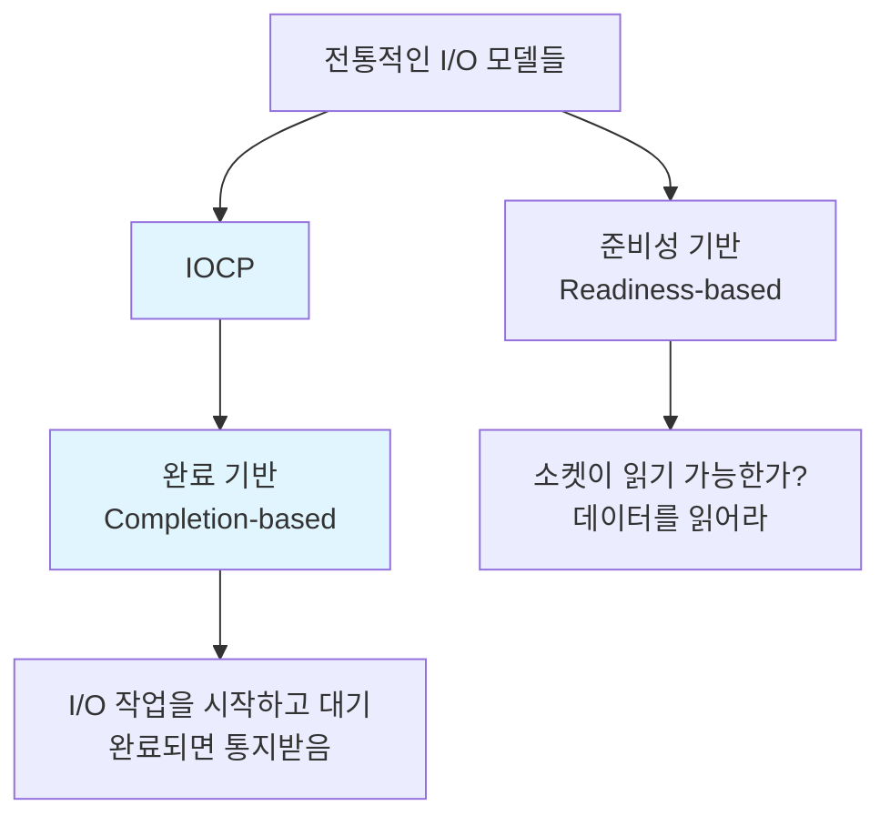
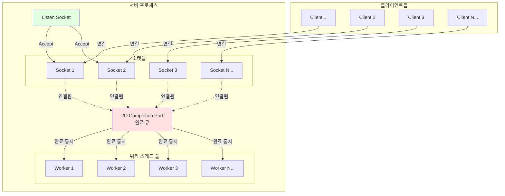

# 1주일만에 배우는 IOCP 게임 서버 프로그래밍   

저자: 최흥배, AI-Assisted   
    
권장 개발 환경
- **IDE**: Visual Studio 2022 (Community 이상)
- **컴파일러**: MSVC v143 (C++20 지원)
- **OS**: Windows 10 이상

-----   
  
# Chapter 1. IOCP 게임 서버 프로그래밍 시작하기
게임 서버 개발자의 여정은 네트워크 I/O를 어떻게 효율적으로 처리할 것인가라는 근본적인 질문에서 시작된다. 수천 명의 플레이어가 동시에 접속하여 실시간으로 상호작용하는 게임 서버를 구축하기 위해서는 단순한 네트워크 프로그래밍 지식을 넘어서, 운영체제 수준의 고성능 I/O 메커니즘을 이해하고 활용해야 한다. 이 챕터에서는 Windows 플랫폼에서 제공하는 가장 강력한 비동기 I/O 모델인 IOCP(Input/Output Completion Port)를 중심으로, 게임 서버 프로그래밍의 세계로 첫 발을 내딛는다.

## 1.1 게임 서버와 네트워크 I/O 모델
게임 서버는 일반적인 웹 서버나 파일 서버와는 다른 특성을 가진다. 웹 서버가 주로 요청-응답 패턴의 단발성 통신을 처리한다면, 게임 서버는 지속적인 연결을 유지하면서 실시간으로 양방향 데이터를 주고받아야 한다. 한 명의 플레이어가 이동하면 주변의 다른 플레이어들에게 즉시 그 정보가 전달되어야 하며, 전투가 발생하면 관련된 모든 클라이언트에게 밀리초 단위의 지연으로 결과가 브로드캐스트되어야 한다.

이러한 요구사항을 만족시키기 위해서는 효율적인 네트워크 I/O 모델이 필수적이다. Windows 환경에서는 여러 가지 소켓 I/O 모델을 제공하는데, 각각의 모델은 서로 다른 성능 특성과 복잡도를 가진다.

**동기 Blocking 모델**  
가장 단순한 형태의 네트워크 프로그래밍은 동기 Blocking 모델이다. recv() 함수를 호출하면 데이터가 도착할 때까지 스레드가 블로킹되고, send() 함수는 데이터 전송이 완료될 때까지 반환되지 않는다. 이 모델은 코드가 직관적이고 이해하기 쉽다는 장점이 있지만, 여러 클라이언트를 동시에 처리하기 위해서는 클라이언트마다 별도의 스레드를 생성해야 한다.

```
[클라이언트 1] ─── [스레드 1: recv() 대기 중...]
[클라이언트 2] ─── [스레드 2: recv() 대기 중...]
[클라이언트 3] ─── [스레드 3: recv() 대기 중...]
...
[클라이언트 N] ─── [스레드 N: recv() 대기 중...]
```

1000명의 동시 접속자를 처리하려면 1000개의 스레드가 필요하다. 각 스레드는 자체 스택 메모리를 소비하며(기본 1MB), 컨텍스트 스위칭 오버헤드가 급격히 증가한다. 대부분의 시간 동안 스레드들은 데이터를 기다리며 블로킹 상태에 있으므로, CPU 자원이 낭비되는 것은 아니지만 메모리 사용량과 스케줄링 비용이 시스템의 한계가 된다.

**Select 모델**  
Select 모델은 하나의 스레드로 여러 소켓을 동시에 감시할 수 있는 I/O 멀티플렉싱 방식이다. select() 함수에 감시하고자 하는 소켓들의 집합을 전달하면, 그 중 하나라도 읽기/쓰기가 가능한 상태가 되거나 타임아웃이 발생할 때까지 블로킹된다.

```cpp
fd_set readfds;
FD_ZERO(&readfds);
FD_SET(socket1, &readfds);
FD_SET(socket2, &readfds);
// ... 더 많은 소켓 추가

select(0, &readfds, nullptr, nullptr, &timeout);
```

Select 모델의 가장 큰 문제는 Windows에서 FD_SETSIZE가 기본적으로 64로 제한되어 있어 한 번에 64개의 소켓만 감시할 수 있다는 점이다. 또한 매번 select() 호출 시마다 소켓 디스크립터 배열을 커널에 복사해야 하므로 소켓 수가 증가할수록 성능이 저하된다. 리눅스의 epoll이나 BSD의 kqueue와 달리, select는 현대적인 고성능 서버에는 적합하지 않다.

**WSAAsyncSelect 모델**  
Windows의 메시지 기반 비동기 I/O 모델인 WSAAsyncSelect는 소켓 이벤트를 윈도우 메시지로 수신한다. 소켓에서 FD_READ, FD_WRITE, FD_ACCEPT, FD_CLOSE 등의 이벤트가 발생하면 지정된 윈도우 핸들로 메시지가 전달된다.

```cpp
WSAAsyncSelect(socket, hWnd, WM_SOCKET, FD_READ | FD_WRITE | FD_CLOSE);
```

이 모델은 GUI 애플리케이션에서는 편리하지만, 서버 프로그래밍에는 적합하지 않다. 윈도우 메시지 큐는 단일 스레드로 처리되므로 멀티코어의 이점을 활용할 수 없으며, 메시지 처리 속도가 소켓 이벤트 발생 속도를 따라가지 못하면 병목이 발생한다.

**WSAEventSelect 모델**  
WSAEventSelect는 소켓 이벤트와 Win32 이벤트 객체를 연결하는 방식이다. 여러 소켓에 대한 이벤트 객체를 배열로 관리하고, WSAWaitForMultipleEvents() 함수로 동시에 대기할 수 있다.

```cpp
WSAEVENT hEvent = WSACreateEvent();
WSAEventSelect(socket, hEvent, FD_READ | FD_WRITE | FD_CLOSE);
```

Select보다 효율적이지만 WSAWaitForMultipleEvents()는 최대 64개의 이벤트만 동시에 대기할 수 있다는 제한이 있다. 이를 우회하기 위해 여러 워커 스레드를 사용할 수 있지만, 소켓과 스레드 간의 매핑 관리가 복잡해진다.

**Overlapped I/O와 IOCP의 등장**  
위의 모든 모델들이 가진 공통적인 한계는 확장성(Scalability)이다. 수천, 수만 개의 동시 연결을 효율적으로 처리하기 위해서는 근본적으로 다른 접근이 필요하다. Microsoft는 이 문제를 해결하기 위해 Overlapped I/O 메커니즘과 그것을 효과적으로 활용할 수 있는 IOCP(I/O Completion Port)를 설계했다.

IOCP는 완료 기반(Completion-based) 모델이다. 기존의 준비성 기반(Readiness-based) 모델들이 "이 소켓이 읽기 준비됨"을 알려주는 것과 달리, IOCP는 "이 I/O 작업이 완료됨"을 통지한다. 이는 근본적으로 다른 패러다임이며, 커널 수준에서 최적화된 비동기 처리를 가능하게 한다.



IOCP의 핵심 아이디어는 운영체제가 완료된 I/O 작업들을 효율적인 큐에 저장하고, 제한된 수의 워커 스레드들이 이 큐에서 작업을 가져와 처리하는 것이다. 이는 스레드 풀 패턴과 유사하지만, 커널 수준에서 구현되어 있어 훨씬 더 효율적이다.

## 1.2 IOCP란 무엇인가?  
IOCP(Input/Output Completion Port)는 Windows NT 3.5부터 제공된 고성능 비동기 I/O 메커니즘이다. "Completion Port"라는 이름에서 알 수 있듯이, 이것은 완료된 I/O 작업들이 도착하는 포트(통로)라고 이해할 수 있다.

전통적인 동기 I/O에서는 프로그램이 I/O 작업을 요청하고 그 결과를 기다린다. 하지만 IOCP에서는 I/O 작업을 요청한 후 즉시 반환되고, 나중에 운영체제가 작업 완료를 통지한다. 이 과정에서 프로그램은 다른 작업을 계속할 수 있으므로, CPU 자원을 효율적으로 활용할 수 있다.

**IOCP의 핵심 개념**   
IOCP를 이해하기 위해서는 몇 가지 핵심 개념을 파악해야 한다.

첫째, Completion Port 객체 자체는 커널 객체이다. CreateIoCompletionPort() 함수로 생성하며, 이것은 완료된 I/O 작업들이 큐잉되는 커널 내부의 자료구조를 나타내는 핸들이다. 이 큐는 선입선출(FIFO) 방식으로 동작하며, 스레드 안전하다.

둘째, 소켓이나 파일 핸들을 Completion Port에 연결(Associate)해야 한다. 연결된 핸들에서 발생한 비동기 I/O 작업이 완료되면, 그 결과가 자동으로 해당 Completion Port의 큐에 추가된다.

셋째, Overlapped 구조체는 각 비동기 I/O 작업을 식별하고 추적하는 데 사용된다. WSARecv()나 WSASend() 같은 함수를 호출할 때 OVERLAPPED 구조체를 전달하면, 작업이 완료되었을 때 이 구조체를 통해 어떤 작업이 완료되었는지 알 수 있다.

넷째, 워커 스레드들이 GetQueuedCompletionStatus() 함수를 호출하여 완료된 I/O 작업을 가져온다. 여러 스레드가 동시에 이 함수를 호출할 수 있으며, 운영체제는 효율적으로 작업을 분배한다.  

```
╔══════════════════════════════════════════════════════════════════════════════════════╗
║                        IOCP (I/O Completion Port) 구조                              ║
╚══════════════════════════════════════════════════════════════════════════════════════╝

  [ 1. Completion Port 커널 객체 ]
  ─────────────────────────────────────────────────────────────────
  CreateIoCompletionPort()
         │
         ▼
  ┌─────────────────────────────────────────┐
  │         Kernel Object (Handle)          │
  │                                         │
  │   ┌───────────────────────────────┐     │
  │   │     Completion Queue (FIFO)   │     │
  │   │  ┌──────┬──────┬──────┬────┐  │     │
  │   │  │ I/O1 │ I/O2 │ I/O3 │ …  │  │     │
  │   │  └──────┴──────┴──────┴────┘  │     │
  │   │      ← 선입선출 / Thread-Safe  │     │
  │   └───────────────────────────────┘     │
  └─────────────────────────────────────────┘


  [ 2. 소켓/파일 핸들 연결 (Associate) ]
  ─────────────────────────────────────────────────────────────────

  ┌──────────────┐     CreateIoCompletionPort()     ┌──────────────────────┐
  │ Socket Handle│ ──────────────────────────────► │  Completion Port     │
  └──────────────┘                                  │  (Kernel Object)     │
  ┌──────────────┐     연결된 핸들에서 비동기 I/O    │                      │
  │  File Handle │ ──────────────────────────────► │  ┌─────────────────┐ │
  └──────────────┘      완료 시 자동으로 큐에 추가  │  │  FIFO Queue     │ │
                                                    │  └─────────────────┘ │
                                                    └──────────────────────┘


  [ 3. OVERLAPPED 구조체 ]
  ─────────────────────────────────────────────────────────────────

  WSARecv() / WSASend()
         │
         │  전달
         ▼
  ┌────────────────────────┐
  │   OVERLAPPED struct    │   ◄── 각 비동기 I/O 작업을 식별·추적
  │ ┌────────────────────┐ │
  │ │  Internal          │ │
  │ │  InternalHigh      │ │
  │ │  Offset            │ │
  │ │  OffsetHigh        │ │
  │ │  hEvent            │ │
  │ └────────────────────┘ │
  └────────────┬───────────┘
               │  작업 완료 시
               ▼
       어떤 작업인지 식별 가능


  [ 4. 워커 스레드 & 작업 분배 ]
  ─────────────────────────────────────────────────────────────────

  ┌────────────────────────────────────────────────────────────┐
  │                   Worker Thread Pool                       │
  │                                                            │
  │  ┌──────────┐  ┌──────────┐  ┌──────────┐  ┌──────────┐  │
  │  │ Thread 1 │  │ Thread 2 │  │ Thread 3 │  │ Thread N │  │
  │  └────┬─────┘  └────┬─────┘  └────┬─────┘  └────┬─────┘  │
  │       │              │              │              │        │
  │       └──────────────┴──────────────┴──────────────┘       │
  │                            │                               │
  │              GetQueuedCompletionStatus()                   │
  └────────────────────────────┼───────────────────────────────┘
                               │  (동시 호출 가능)
                               ▼
                  ┌────────────────────────┐
                  │   Completion Port      │
                  │   ┌────────────────┐   │
                  │   │  FIFO Queue    │   │
                  │   │ [IO1][IO2][IO3]│   │
                  │   └────────────────┘   │
                  │   OS가 효율적 분배      │
                  └────────────────────────┘


  ┌──────────────────────────────────────────────────────────────┐
  │                    전체 흐름 요약                             │
  │                                                              │
  │  Socket/File                                                 │
  │  Handle    ──Associate──►  Completion Port (Kernel)          │
  │                                    │                         │
  │  WSARecv()                         │  완료 시 자동 큐잉      │
  │  + OVERLAPPED ──────────────────►  │                         │
  │                                    ▼                         │
  │                          ┌─────────────────┐                 │
  │                          │   FIFO Queue    │                 │
  │                          └────────┬────────┘                 │
  │                                   │                          │
  │                    GetQueuedCompletionStatus()                │
  │                                   │                          │
  │                    ┌──────────────┼──────────────┐           │
  │                    ▼              ▼              ▼           │
  │               [Thread 1]     [Thread 2]     [Thread N]       │
  └──────────────────────────────────────────────────────────────┘
```


**IOCP의 장점**  
IOCP가 다른 I/O 모델에 비해 가지는 가장 큰 장점은 확장성과 효율성이다. 

첫 번째로, 동시 연결 수에 대한 실질적인 제한이 없다. Select나 WSAEventSelect처럼 64개 같은 인위적인 제한이 없으며, 수만 개의 소켓을 하나의 Completion Port에 연결할 수 있다. 메모리가 허용하는 한 무제한으로 확장 가능하다.

두 번째로, 스레드 수를 최적화할 수 있다. 전통적인 스레드 per 연결 모델에서는 클라이언트 수만큼 스레드가 필요하지만, IOCP에서는 CPU 코어 수에 맞춰 워커 스레드 수를 조절할 수 있다. 일반적으로 CPU 코어 수의 2배 정도의 워커 스레드를 사용하는 것이 최적이다.

세 번째로, 커널 모드에서 최적화된다. IOCP는 단순한 사용자 모드 라이브러리가 아니라 Windows 커널에 깊이 통합되어 있다. 이는 컨텍스트 스위칭을 최소화하고, 캐시 효율성을 높이며, 시스템 전체의 리소스를 효율적으로 관리할 수 있게 한다.

네 번째로, 자동 로드 밸런싱이 제공된다. 여러 워커 스레드가 대기 중일 때, 커널은 가장 오랫동안 대기한 스레드를 깨워 작업을 할당한다. 이는 캐시 히트율을 높이고, 불필요한 스레드 전환을 줄인다.  
     
```
╔══════════════════════════════════════════════════════════════════════════════════════╗
║                     IOCP 장점: 확장성과 효율성                                      ║
╚══════════════════════════════════════════════════════════════════════════════════════╝

  [ 1. 동시 연결 수 제한 없음 ]
  ─────────────────────────────────────────────────────────────────────────────────────

  Select / WSAEventSelect              IOCP
  ┌──────────────────────┐            ┌──────────────────────────────────────────────┐
  │  최대 64개 소켓 제한  │            │         수만 개의 소켓 연결 가능              │
  │                      │            │                                              │
  │  [S1][S2]...[S64] ✗  │            │  [S1][S2][S3]...[S9999][S10000]... ✔        │
  │   65번째 소켓 불가!   │            │                    │                         │
  └──────────────────────┘            │                    ▼                         │
                                      │         ┌─────────────────────┐              │
         vs                           │         │   Completion Port   │              │
                                      │         │   (메모리 한계까지)  │              │
                                      │         │      무제한 확장     │              │
                                      │         └─────────────────────┘              │
                                      └──────────────────────────────────────────────┘


  [ 2. 스레드 수 최적화 ]
  ─────────────────────────────────────────────────────────────────────────────────────

  전통적 Thread-per-Connection 모델         IOCP 모델
  ┌──────────────────────────────┐          ┌────────────────────────────────────────┐
  │  Client 1  → Thread 1        │          │  Client 1  ─┐                          │
  │  Client 2  → Thread 2        │          │  Client 2  ─┤                          │
  │  Client 3  → Thread 3        │          │  Client 3  ─┤                          │
  │     ...          ...         │          │     ...     ├──► Completion Port        │
  │  Client N  → Thread N        │          │  Client N  ─┤                          │
  │                              │          │             │    ┌──────────────────┐   │
  │  N개 클라이언트 = N개 스레드  │          │             │    │   Worker Threads  │   │
  │  컨텍스트 스위칭 폭발! ✗     │          │             └──► │  CPU Core수 × 2  │   │
  └──────────────────────────────┘          │                  │  [T1][T2][T3][T4]│   │
                                            │                  └──────────────────┘   │
                                            │   최적 스레드 수 = CPU 코어 수 × 2  ✔   │
                                            └────────────────────────────────────────┘

  CPU 4코어 기준:
  ┌────────────────────────────────────────────────────────────┐
  │  권장 Worker Thread 수 = 4 Core × 2 = 8 Threads           │
  │                                                            │
  │  [Core1][Core2][Core3][Core4]                              │
  │     │      │      │      │                                 │
  │  [T1][T2][T3][T4][T5][T6][T7][T8]  ← 최적 균형           │
  └────────────────────────────────────────────────────────────┘


  [ 3. 커널 모드 최적화 ]
  ─────────────────────────────────────────────────────────────────────────────────────

                         Windows Architecture
  ┌──────────────────────────────────────────────────────────────────────────┐
  │  User Mode                                                               │
  │  ┌──────────────────────────────────────────────────────────────────┐   │
  │  │   Application          Worker Threads          단순 라이브러리 ✗ │   │
  │  └──────────────────────────────────────────────────────────────────┘   │
  ├──────────────────────── Kernel Boundary ─────────────────────────────── ┤
  │  Kernel Mode                                                             │
  │  ┌──────────────────────────────────────────────────────────────────┐   │
  │  │                                                                  │   │
  │  │   ┌─────────────────────────────────────────────────────────┐   │   │
  │  │   │              IOCP (깊이 통합된 커널 컴포넌트)  ✔         │   │   │
  │  │   │                                                         │   │   │
  │  │   │  ┌───────────────┐  ┌──────────────┐  ┌─────────────┐  │   │   │
  │  │   │  │  컨텍스트 스위 │  │ 캐시 효율성  │  │ 리소스 관리 │  │   │   │
  │  │   │  │  칭 최소화 ✔  │  │    향상  ✔   │  │  최적화 ✔   │  │   │   │
  │  │   │  └───────────────┘  └──────────────┘  └─────────────┘  │   │   │
  │  │   └─────────────────────────────────────────────────────────┘   │   │
  │  │                                                                  │   │
  │  └──────────────────────────────────────────────────────────────────┘   │
  └──────────────────────────────────────────────────────────────────────────┘


  [ 4. 자동 로드 밸런싱 ]
  ─────────────────────────────────────────────────────────────────────────────────────

  여러 Worker Thread 대기 중:
  ┌──────────────────────────────────────────────────────────────────────────┐
  │                                                                          │
  │   대기 시간:  [ Thread1: 500ms ] [ Thread2: 300ms ] [ Thread3: 100ms ]  │
  │                     ▲                                                    │
  │                  가장 오래                                                │
  │                  대기한 스레드                                            │
  │                                                                          │
  │   새 I/O 완료 이벤트 발생!                                                │
  │              │                                                           │
  │              ▼                                                           │
  │   ┌──────────────────────────────────────────────────────────────────┐  │
  │   │   Kernel 자동 선택: Thread1 (가장 오래 대기) 을 Wake-up          │  │
  │   └──────────────────────────────────────────────────────────────────┘  │
  │              │                                                           │
  │              ▼                                                           │
  │   ┌─────────────────────────────────────────────────────────────────┐   │
  │   │  효과:                                                          │   │
  │   │   ✔ 캐시 히트율 향상  (같은 스레드 → 같은 캐시 데이터 재사용)  │   │
  │   │   ✔ 불필요한 스레드 전환 최소화                                 │   │
  │   │   ✔ CPU 리소스 균등 배분                                        │   │
  │   └─────────────────────────────────────────────────────────────────┘   │
  └──────────────────────────────────────────────────────────────────────────┘


  ┌──────────────────────────────────────────────────────────────────────────────────┐
  │                           IOCP 장점 총정리                                        │
  │                                                                                  │
  │   1. 연결 수    │  Select 64개 한계  ───────►  수만 개 무제한 확장       ✔       │
  │   ─────────────┼─────────────────────────────────────────────────────────────   │
  │   2. 스레드 수  │  N 클라이언트 = N 스레드  ►  CPU 코어 × 2 (최적)      ✔       │
  │   ─────────────┼─────────────────────────────────────────────────────────────   │
  │   3. 커널 통합  │  사용자 모드 라이브러리   ►  커널 깊이 통합 / 최적화   ✔       │
  │   ─────────────┼─────────────────────────────────────────────────────────────   │
  │   4. 로드밸런싱 │  수동 분배                ►  커널 자동 분배 / 캐시 최적 ✔      │
  └──────────────────────────────────────────────────────────────────────────────────┘
```     
  
**IOCP의 적용 사례**  
IOCP는 Windows 플랫폼의 고성능 서버 애플리케이션에서 널리 사용된다. Microsoft의 SQL Server, Exchange Server, IIS(Internet Information Services) 등이 모두 IOCP를 기반으로 구축되었다. 게임 산업에서도 대규모 멀티플레이어 온라인 게임(MMORPG)의 서버가 IOCP를 활용한다.

예를 들어, 동시 접속자 10만 명을 처리하는 MMORPG 서버를 생각해보자. 전통적인 모델에서는 최소한 수만 개의 스레드가 필요하지만, IOCP 기반 서버는 16코어 CPU에서 32개 정도의 워커 스레드만으로도 충분히 처리할 수 있다. 이는 메모리 사용량을 극적으로 줄이고, 스레드 스케줄링 오버헤드를 최소화한다.
  

## 1.3 IOCP의 동작 원리와 아키텍처
IOCP의 내부 동작을 이해하는 것은 효과적으로 활용하기 위한 필수 조건이다. 겉으로 보이는 API는 단순하지만, 그 이면의 메커니즘은 정교하게 설계되어 있다.

**IOCP의 전체 구조**

IOCP 기반 서버의 아키텍처는 다음과 같이 구성된다.



Listen Socket은 새로운 클라이언트의 연결을 받아들인다. Accept된 각 소켓은 Completion Port에 연결되고, 이후 모든 I/O 작업은 비동기로 처리된다. 워커 스레드들은 Completion Port에서 완료된 작업을 꺼내어 처리하는 무한 루프를 실행한다.

**I/O 작업의 생명주기**  
하나의 비동기 수신 작업이 어떻게 처리되는지 단계별로 살펴보자.

1. **I/O 작업 시작**: 워커 스레드가 WSARecv() 함수를 호출하여 수신 작업을 시작한다. 이때 OVERLAPPED 구조체와 버퍼를 전달한다.

```cpp
WSABUF wsaBuf;
wsaBuf.buf = recvBuffer;
wsaBuf.len = BUFFER_SIZE;

DWORD flags = 0;
WSARecv(socket, &wsaBuf, 1, nullptr, &flags, &overlapped, nullptr);
```

2. **즉시 반환**: WSARecv()는 대부분의 경우 즉시 반환된다. 반환 값이 SOCKET_ERROR이고 WSAGetLastError()가 WSA_IO_PENDING을 반환하면, 이는 정상적인 비동기 동작이다. 실제 I/O 작업은 백그라운드에서 진행된다.

3. **커널 수준 처리**: 네트워크 카드에서 데이터가 도착하면, 인터럽트가 발생하고 커널의 네트워크 스택이 데이터를 처리한다. 데이터는 소켓 버퍼로 복사되고, 커널은 대기 중인 비동기 I/O 요청을 확인한다.

4. **완료 통지**: I/O 작업이 완료되면, 커널은 해당 소켓이 연결된 Completion Port의 큐에 완료 패킷을 추가한다. 이 패킷에는 전송된 바이트 수, Completion Key, OVERLAPPED 구조체 포인터 등이 포함된다.

5. **스레드 깨우기**: 만약 워커 스레드가 GetQueuedCompletionStatus()에서 대기 중이라면, 커널은 하나의 스레드를 깨워 완료 패킷을 전달한다. 어떤 스레드를 깨울지는 커널의 스케줄링 알고리즘에 따라 결정된다.

6. **작업 처리**: 깨어난 워커 스레드는 완료된 I/O 작업의 결과를 확인하고, 수신된 데이터를 처리한다. 그리고 다시 GetQueuedCompletionStatus()를 호출하여 다음 작업을 대기한다.
  

**Completion Key와 Per-Handle Data**   
Completion Port에 소켓을 연결할 때, Completion Key라는 값을 지정할 수 있다. 이 값은 I/O 완료 시 함께 반환되므로, 어떤 소켓이나 세션에 대한 작업인지 빠르게 식별할 수 있다.

```cpp
CreateIoCompletionPort(
    (HANDLE)socket,
    hCompletionPort,
    (ULONG_PTR)sessionPtr,  // Completion Key로 세션 포인터 전달
    0
);
```

일반적으로 Completion Key에는 세션 객체의 포인터를 저장한다. 그러면 GetQueuedCompletionStatus()에서 반환받은 Completion Key를 통해 즉시 세션 객체에 접근할 수 있다.

**동시 실행 스레드 수 제한**  
CreateIoCompletionPort()의 마지막 파라미터는 동시에 실행될 수 있는 스레드의 최대 개수를 지정한다. 이를 0으로 설정하면 시스템의 프로세서 개수만큼 허용된다.

```cpp
HANDLE hCompletionPort = CreateIoCompletionPort(
    INVALID_HANDLE_VALUE,
    nullptr,
    0,
    0  // 동시 실행 스레드 수 = CPU 코어 수
);
```

이 제한은 오버스케줄링을 방지하기 위한 것이다. 만약 4개의 CPU 코어가 있는데 8개의 워커 스레드가 모두 동시에 실행되면, 과도한 컨텍스트 스위칭으로 오히려 성능이 저하될 수 있다. IOCP는 지정된 수만큼의 스레드만 동시에 깨우고, 하나의 스레드가 블로킹되면 추가 스레드를 깨워 균형을 유지한다.

**OVERLAPPED 구조체의 확장**   
OVERLAPPED 구조체는 비동기 I/O 작업의 상태를 추적하는 데 사용된다. 하지만 기본 구조체만으로는 작업의 종류(송신/수신)나 관련 버퍼 정보를 저장할 수 없다. 따라서 일반적으로 OVERLAPPED 구조체를 확장하여 사용한다.

```cpp
enum class IOOperation {
    RECV,
    SEND
};

struct IOContext {
    OVERLAPPED overlapped;  // 반드시 첫 번째 멤버여야 함
    IOOperation operation;
    WSABUF wsaBuf;
    char buffer[BUFFER_SIZE];
};
```

이렇게 확장된 구조체를 사용하면, GetQueuedCompletionStatus()에서 OVERLAPPED 포인터를 받았을 때 이를 IOContext 포인터로 캐스팅하여 추가 정보에 접근할 수 있다. OVERLAPPED가 구조체의 첫 번째 멤버로 배치되어 있어야 포인터 캐스팅이 안전하게 동작한다.


**에러 처리와 예외 상황**  
IOCP를 사용할 때 반드시 고려해야 할 에러 상황들이 있다.

첫째, 클라이언트가 비정상적으로 연결을 종료한 경우이다. GetQueuedCompletionStatus()는 전송된 바이트 수가 0을 반환하거나, 특정 에러 코드를 반환한다. 이 경우 소켓을 정리하고 세션을 종료해야 한다.

둘째, 비동기 I/O 작업이 즉시 완료되는 경우이다. 예를 들어 WSASend()를 호출했는데 송신 버퍼에 충분한 공간이 있어서 즉시 완료될 수 있다. 이 경우에도 여전히 완료 통지가 Completion Port로 전달되므로, 중복 처리를 방지해야 한다.

셋째, 시스템 리소스 부족으로 I/O 작업이 실패하는 경우이다. 메모리 부족, 핸들 부족 등의 상황에서 적절한 복구 전략이 필요하다.
  

## 1.4 개발 환경 설정 (Visual Studio 2022, Windows 11)
IOCP 게임 서버 개발을 시작하기 위한 개발 환경을 구축한다. Visual Studio 2022는 최신 C++ 표준을 지원하며, Windows 11은 최신 Windows API를 제공한다.

**Visual Studio 2022 설치**  
Visual Studio 2022 Community Edition을 다운로드하여 설치한다. 설치 시 다음 워크로드를 선택해야 한다.

- C++를 사용한 데스크톱 개발: 이 워크로드는 MSVC 컴파일러, Windows SDK, 디버깅 도구 등을 포함한다.
- Windows 11 SDK: 최신 Windows API와 헤더 파일이 필요하다.

설치가 완료되면 Visual Studio를 실행하고 새 프로젝트를 생성한다. "빈 프로젝트" 또는 "콘솔 앱"을 선택하면 된다.

**프로젝트 속성 설정**  
생성된 프로젝트의 속성을 올바르게 설정해야 한다. 프로젝트를 우클릭하고 "속성"을 선택한다.

첫째, C++ 언어 표준을 설정한다. "구성 속성 > C/C++ > 언어"에서 "C++ 언어 표준"을 "ISO C++20 표준(/std:c++20)" 또는 "미리 보기 - 최신 C++ 작업 초안의 기능(/std:c++latest)"으로 설정한다. 이를 통해 std::atomic, std::thread, std::format 등 최신 C++ 기능을 사용할 수 있다.

둘째, 문자 집합을 설정한다. "구성 속성 > 고급"에서 "문자 집합"을 "멀티바이트 문자 집합 사용"으로 설정한다. 유니코드를 사용할 수도 있지만, 네트워크 프로토콜은 대부분 바이트 단위로 처리되므로 멀티바이트가 더 직관적이다.

셋째, 추가 라이브러리를 링크한다. "구성 속성 > 링커 > 입력"의 "추가 종속성"에 다음을 추가한다.

```
ws2_32.lib
mswsock.lib
```

ws2_32.lib는 Winsock2의 기본 라이브러리이고, mswsock.lib는 AcceptEx, TransmitFile 등 확장 함수들을 포함한다.

**필수 헤더 파일 포함**  
IOCP 프로그래밍에 필요한 헤더 파일들을 정리한다. 일반적으로 공통 헤더 파일(예: pch.h 또는 Common.h)에 다음을 포함시킨다.

```cpp
// Windows 헤더
#define WIN32_LEAN_AND_MEAN
#include <windows.h>
#include <winsock2.h>
#include <ws2tcpip.h>
#include <mswsock.h>

// C++ 표준 라이브러리
#include <iostream>
#include <thread>
#include <vector>
#include <queue>
#include <memory>
#include <atomic>
#include <mutex>
#include <format>

// 링크 라이브러리 지정
#pragma comment(lib, "ws2_32.lib")
#pragma comment(lib, "mswsock.lib")
```

WIN32_LEAN_AND_MEAN 매크로는 거의 사용되지 않는 Windows 헤더들을 제외하여 컴파일 시간을 단축한다. winsock2.h는 반드시 windows.h보다 먼저 포함되어야 한다.

**Winsock 초기화**  
Winsock을 사용하기 전에 반드시 WSAStartup() 함수로 초기화해야 한다. 일반적으로 main() 함수의 시작 부분에서 수행한다.

```cpp
int main()
{
    WSADATA wsaData;
    if (WSAStartup(MAKEWORD(2, 2), &wsaData) != 0) {
        std::cerr << "WSAStartup failed\n";
        return 1;
    }

    // 서버 코드...

    WSACleanup();
    return 0;
}
```

MAKEWORD(2, 2)는 Winsock 2.2 버전을 요청한다. 프로그램 종료 시에는 WSACleanup()을 호출하여 정리해야 한다.
  

**디버그와 릴리스 구성**  
개발 중에는 디버그 구성을 사용하고, 성능 테스트나 배포 시에는 릴리스 구성을 사용한다. 두 구성 간의 주요 차이는 다음과 같다.

디버그 구성에서는 최적화가 비활성화되고(/Od), 디버그 정보가 포함되며(/Zi), 런타임 체크가 활성화된다. 이는 개발 중 문제를 빠르게 찾는 데 도움이 된다.

릴리스 구성에서는 최대 최적화(/O2 또는 /Ox)가 활성화되고, 인라인 함수 확장이 적극적으로 이루어지며, 디버그 코드가 제거된다. 성능을 측정할 때는 반드시 릴리스 구성으로 빌드해야 한다.
  

## 1.5 프로젝트 구성과 기본 설정
효율적인 코드 관리를 위해 프로젝트를 적절히 구조화한다. IOCP 서버 프로젝트는 여러 모듈로 나뉘며, 각 모듈은 명확한 책임을 가진다.

**프로젝트 구조**

다음과 같은 디렉토리 구조를 권장한다.

```
IOCPGameServer/
├── Common/
│   ├── Types.h          // 공통 타입 정의
│   ├── Config.h         // 설정 상수
│   └── Logger.h/cpp     // 로깅 시스템
├── Network/
│   ├── IOCPServer.h/cpp    // IOCP 서버 메인
│   ├── Session.h/cpp       // 세션 관리
│   ├── PacketBuffer.h/cpp  // 패킷 버퍼
│   └── Protocol.h          // 프로토콜 정의
├── Game/
│   ├── GameLogic.h/cpp     // 게임 로직
│   └── Room.h/cpp          // 게임 룸
└── Main.cpp                 // 엔트리 포인트
```

이러한 구조는 네트워크 계층과 게임 로직을 분리하여 유지보수성을 높인다.

**공통 타입 정의**  
Types.h에는 프로젝트 전체에서 사용할 타입들을 정의한다.

```cpp
#pragma once
#include <cstdint>

using SessionID = uint64_t;
using PacketID = uint16_t;
using PacketSize = uint16_t;

constexpr size_t MAX_BUFFER_SIZE = 8192;
constexpr size_t MAX_PACKET_SIZE = 4096;
constexpr int MAX_SESSIONS = 10000;
```

명시적인 크기의 정수 타입(uint64_t, uint16_t 등)을 사용하면 플랫폼 간 호환성이 향상된다.

**설정 상수**  
Config.h에는 서버 설정과 관련된 상수들을 모아둔다.

```cpp
#pragma once

namespace Config {
    constexpr int SERVER_PORT = 9000;
    constexpr const char* BIND_ADDRESS = "0.0.0.0";
    
    constexpr int WORKER_THREAD_COUNT = 4;
    constexpr int MAX_CONCURRENT_THREADS = 0;  // 0 = CPU 코어 수
    
    constexpr int RECV_BUFFER_SIZE = 4096;
    constexpr int SEND_BUFFER_SIZE = 4096;
}
```

이러한 상수들은 나중에 설정 파일에서 읽어오도록 확장할 수 있다.
  
**기본 로깅 시스템**  
개발 과정에서 로그는 필수적이다. 간단한 로깅 시스템을 구현한다.

```cpp
// Logger.h
#pragma once
#include <iostream>
#include <mutex>
#include <format>
#include <chrono>

class Logger {
public:
    enum class Level {
        DEBUG,
        INFO,
        WARN,
        ERROR
    };

    template<typename... Args>
    static void Log(Level level, const std::string& fmt, Args&&... args) {
        std::lock_guard<std::mutex> lock(mutex_);
        
        auto now = std::chrono::system_clock::now();
        auto time = std::chrono::system_clock::to_time_t(now);
        
        std::cout << "[" << GetLevelString(level) << "] ";
        std::cout << std::format(fmt, std::forward<Args>(args)...) << "\n";
    }

private:
    static std::mutex mutex_;
    
    static const char* GetLevelString(Level level) {
        switch (level) {
            case Level::DEBUG: return "DEBUG";
            case Level::INFO:  return "INFO";
            case Level::WARN:  return "WARN";
            case Level::ERROR: return "ERROR";
            default: return "UNKNOWN";
        }
    }
};

// 편의 매크로
#define LOG_DEBUG(...) Logger::Log(Logger::Level::DEBUG, __VA_ARGS__)
#define LOG_INFO(...)  Logger::Log(Logger::Level::INFO, __VA_ARGS__)
#define LOG_WARN(...)  Logger::Log(Logger::Level::WARN, __VA_ARGS__)
#define LOG_ERROR(...) Logger::Log(Logger::Level::ERROR, __VA_ARGS__)
```

C++20의 std::format을 사용하면 타입 안전한 문자열 포맷팅이 가능하다. 멀티스레드 환경에서 안전하도록 mutex로 보호한다.
  
**에러 처리 헬퍼 함수**  
Windows API의 에러를 처리하는 헬퍼 함수를 작성한다.

```cpp
inline void PrintLastError(const char* context) {
    DWORD errorCode = GetLastError();
    LPSTR messageBuffer = nullptr;
    
    FormatMessageA(
        FORMAT_MESSAGE_ALLOCATE_BUFFER | FORMAT_MESSAGE_FROM_SYSTEM,
        nullptr,
        errorCode,
        0,
        (LPSTR)&messageBuffer,
        0,
        nullptr
    );
    
    LOG_ERROR("{}: {} (Error code: {})", context, messageBuffer, errorCode);
    LocalFree(messageBuffer);
}

inline void PrintWSAError(const char* context) {
    int errorCode = WSAGetLastError();
    LOG_ERROR("{}: WSA Error code: {}", context, errorCode);
}
```

이 함수들은 Windows API나 Winsock 함수가 실패했을 때 에러 메시지를 로그에 출력한다.

**스마트 포인터와 RAII**  
C++ 11 이후의 스마트 포인터를 적극 활용하여 메모리 관리를 자동화한다. 특히 세션 객체처럼 여러 곳에서 공유되는 객체는 std::shared_ptr을 사용한다.

```cpp
class Session;
using SessionPtr = std::shared_ptr<Session>;
```

또한 RAII(Resource Acquisition Is Initialization) 패턴을 활용하여 소켓이나 핸들을 안전하게 관리한다.

```cpp
class SocketHandle {
public:
    SocketHandle() : socket_(INVALID_SOCKET) {}
    explicit SocketHandle(SOCKET s) : socket_(s) {}
    
    ~SocketHandle() {
        Close();
    }
    
    SocketHandle(const SocketHandle&) = delete;
    SocketHandle& operator=(const SocketHandle&) = delete;
    
    SocketHandle(SocketHandle&& other) noexcept : socket_(other.socket_) {
        other.socket_ = INVALID_SOCKET;
    }
    
    void Close() {
        if (socket_ != INVALID_SOCKET) {
            closesocket(socket_);
            socket_ = INVALID_SOCKET;
        }
    }
    
    SOCKET Get() const { return socket_; }
    SOCKET Release() {
        SOCKET s = socket_;
        socket_ = INVALID_SOCKET;
        return s;
    }

private:
    SOCKET socket_;
};
```

이렇게 하면 예외가 발생하거나 함수가 일찍 반환되더라도 소켓이 자동으로 닫힌다.
  

**정리**  

이 챕터에서는 IOCP의 개념과 필요성, 동작 원리를 학습했다. 전통적인 I/O 모델들의 한계를 이해하고, IOCP가 어떻게 이를 극복하는지 살펴보았다. 또한 Visual Studio 2022와 Windows 11 환경에서 IOCP 프로젝트를 설정하는 방법과, 효율적인 코드 구조를 구축하는 방법을 익혔다.

다음 챕터에서는 실제로 IOCP API를 사용하여 기본적인 Echo 서버를 구현하면서, CreateIoCompletionPort, GetQueuedCompletionStatus 같은 핵심 함수들의 실제 동작을 경험하게 된다. Overlapped I/O와 워커 스레드의 상호작용을 직접 코딩하면서, IOCP 프로그래밍의 실무적인 측면을 깊이 있게 다룰 것이다.  