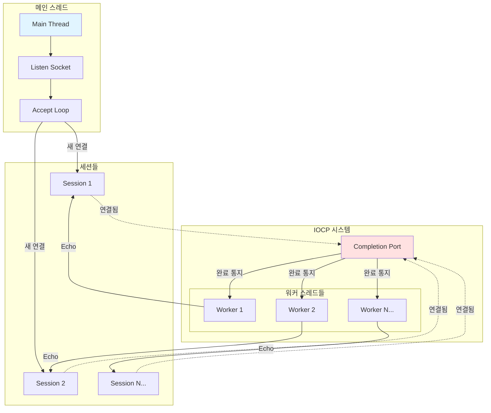

# 1주일만에 배우는 IOCP 게임 서버 프로그래밍   

저자: 최흥배, AI-Assisted   
    
권장 개발 환경
- **IDE**: Visual Studio 2022 (Community 이상)
- **컴파일러**: MSVC v143 (C++20 지원)
- **OS**: Windows 10 이상

-----   
  
# Chapter 2. IOCP 기본 서버 구현
이 챕터에서는 IOCP의 핵심 API들을 실제로 사용하여 동작하는 Echo 서버를 구현한다. CreateIoCompletionPort로 Completion Port를 생성하고, 소켓을 연결하며, GetQueuedCompletionStatus로 완료된 I/O 작업을 처리하는 전체 흐름을 경험한다. 이론으로만 이해했던 Overlapped I/O와 워커 스레드의 상호작용을 직접 코딩하면서, IOCP 프로그래밍의 실무적인 측면을 깊이 있게 다룬다.

## 2.1 IOCP 핵심 API 이해하기
IOCP 프로그래밍의 핵심은 세 가지 API 함수로 이루어진다. CreateIoCompletionPort는 Completion Port 객체를 생성하고 소켓을 연결하는 역할을 한다. GetQueuedCompletionStatus는 완료된 I/O 작업을 가져오는 역할을 하며, PostQueuedCompletionStatus는 사용자 정의 완료 패킷을 수동으로 큐에 추가하는 역할을 한다.

**CreateIoCompletionPort**  
CreateIoCompletionPort 함수는 두 가지 용도로 사용된다. 첫 번째는 새로운 Completion Port 객체를 생성하는 것이고, 두 번째는 기존 Completion Port에 파일 핸들이나 소켓을 연결하는 것이다.

```cpp
HANDLE CreateIoCompletionPort(
    HANDLE    FileHandle,              // 연결할 핸들 (또는 INVALID_HANDLE_VALUE)
    HANDLE    ExistingCompletionPort,  // 기존 CP 핸들 (또는 NULL)
    ULONG_PTR CompletionKey,           // 완료 키
    DWORD     NumberOfConcurrentThreads // 동시 실행 스레드 수
);
```

새로운 Completion Port를 생성할 때는 첫 번째 파라미터에 INVALID_HANDLE_VALUE를 전달하고, 두 번째 파라미터에 NULL을 전달한다.

```cpp
HANDLE hCompletionPort = CreateIoCompletionPort(
    INVALID_HANDLE_VALUE,
    nullptr,
    0,
    0  // 0이면 시스템의 프로세서 개수
);

if (hCompletionPort == nullptr) {
    LOG_ERROR("CreateIoCompletionPort failed");
    return false;
}
```

네 번째 파라미터인 NumberOfConcurrentThreads는 동시에 실행될 수 있는 스레드의 최대 개수를 지정한다. 0으로 설정하면 시스템의 프로세서 개수로 자동 설정된다. 이 값은 오버스케줄링을 방지하기 위한 것으로, CPU 바운드 작업이 많다면 프로세서 개수와 같게, I/O 대기가 많다면 프로세서 개수의 2배 정도로 설정하는 것이 일반적이다.

소켓을 기존 Completion Port에 연결할 때는 다음과 같이 사용한다.

```cpp
HANDLE result = CreateIoCompletionPort(
    (HANDLE)clientSocket,  // 연결할 소켓
    hCompletionPort,       // 기존 CP 핸들
    (ULONG_PTR)sessionPtr, // Completion Key (세션 포인터)
    0                      // 무시됨
);

if (result != hCompletionPort) {
    LOG_ERROR("Failed to associate socket with IOCP");
    return false;
}
```

세 번째 파라미터인 CompletionKey는 매우 중요하다. 이 값은 I/O 완료 시 GetQueuedCompletionStatus를 통해 반환되므로, 어떤 세션에 대한 작업인지 빠르게 식별할 수 있다. 일반적으로 세션 객체의 포인터를 저장한다.

**GetQueuedCompletionStatus**  
GetQueuedCompletionStatus는 워커 스레드가 완료된 I/O 작업을 가져오기 위해 호출하는 함수이다. 완료된 작업이 없으면 블로킹되어 대기하다가, 작업이 완료되면 깨어나서 정보를 반환한다.

```cpp
BOOL GetQueuedCompletionStatus(
    HANDLE       CompletionPort,        // CP 핸들
    LPDWORD      lpNumberOfBytes,       // 전송된 바이트 수
    PULONG_PTR   lpCompletionKey,       // 완료 키
    LPOVERLAPPED *lpOverlapped,         // OVERLAPPED 포인터
    DWORD        dwMilliseconds         // 타임아웃 (밀리초)
);
```

일반적인 사용 패턴은 다음과 같다.

```cpp
DWORD bytesTransferred = 0;
ULONG_PTR completionKey = 0;
LPOVERLAPPED overlapped = nullptr;

BOOL result = GetQueuedCompletionStatus(
    hCompletionPort,
    &bytesTransferred,
    &completionKey,
    &overlapped,
    INFINITE  // 무한 대기
);
```

반환 값과 파라미터들을 해석하는 방법은 다음과 같다.

첫째, 반환 값이 TRUE이고 overlapped가 NULL이 아니면, I/O 작업이 정상적으로 완료된 것이다. bytesTransferred는 실제 전송된 바이트 수를 나타낸다.

둘째, 반환 값이 FALSE이고 overlapped가 NULL이 아니면, I/O 작업이 실패한 것이다. GetLastError()로 에러 코드를 확인해야 한다. 일반적인 에러로는 ERROR_NETNAME_DELETED(클라이언트 연결 종료)가 있다.

셋째, overlapped가 NULL이면 타임아웃이 발생했거나 함수 호출 자체가 실패한 것이다.

넷째, bytesTransferred가 0이면 상대방이 정상적으로 연결을 종료(Graceful Shutdown)한 것이다.

```cpp
if (result == FALSE) {
    DWORD error = GetLastError();
    if (overlapped == nullptr) {
        if (error == WAIT_TIMEOUT) {
            // 타임아웃
            continue;
        } else {
            // 함수 호출 실패
            LOG_ERROR("GetQueuedCompletionStatus failed: {}", error);
            break;
        }
    } else {
        // I/O 작업 실패
        if (error == ERROR_NETNAME_DELETED || error == ERROR_CONNECTION_ABORTED) {
            // 클라이언트 연결 종료
            LOG_INFO("Client disconnected");
        }
    }
}

if (bytesTransferred == 0) {
    // Graceful shutdown
    LOG_INFO("Client closed connection gracefully");
}
```

**PostQueuedCompletionStatus**  
PostQueuedCompletionStatus는 프로그램이 직접 완료 패킷을 Completion Port에 추가하는 함수이다. 주로 워커 스레드를 종료시키거나, 사용자 정의 이벤트를 전달할 때 사용된다.

```cpp
BOOL PostQueuedCompletionStatus(
    HANDLE       CompletionPort,    // CP 핸들
    DWORD        dwNumberOfBytes,   // 바이트 수
    ULONG_PTR    dwCompletionKey,   // 완료 키
    LPOVERLAPPED lpOverlapped       // OVERLAPPED 포인터
);
```

워커 스레드를 종료시키는 전형적인 패턴은 특별한 완료 키 값을 정의하고, 종료 시 이 값을 전송하는 것이다.

```cpp
constexpr ULONG_PTR SHUTDOWN_KEY = 0;

// 서버 종료 시 모든 워커 스레드에 종료 신호 전송
void ShutdownWorkerThreads(HANDLE hCompletionPort, int threadCount) {
    for (int i = 0; i < threadCount; ++i) {
        PostQueuedCompletionStatus(hCompletionPort, 0, SHUTDOWN_KEY, nullptr);
    }
}

// 워커 스레드에서 종료 신호 확인
void WorkerThread(HANDLE hCompletionPort) {
    while (true) {
        DWORD bytesTransferred;
        ULONG_PTR completionKey;
        LPOVERLAPPED overlapped;
        
        GetQueuedCompletionStatus(hCompletionPort, &bytesTransferred, 
                                  &completionKey, &overlapped, INFINITE);
        
        if (completionKey == SHUTDOWN_KEY) {
            LOG_INFO("Worker thread shutting down");
            break;
        }
        
        // 일반 I/O 처리...
    }
}
```

이 방법을 사용하면 워커 스레드가 블로킹된 상태에서도 안전하게 종료시킬 수 있다.
  

## 2.2 Overlapped I/O 구조체 이해하기
Overlapped I/O는 비동기 I/O의 핵심 메커니즘이다. OVERLAPPED 구조체는 각 비동기 I/O 작업을 추적하고, 작업 완료 시 운영체제가 이 구조체에 결과를 기록한다.

**OVERLAPPED 구조체의 구조**  
Windows SDK에 정의된 OVERLAPPED 구조체는 다음과 같다.

```cpp
typedef struct _OVERLAPPED {
    ULONG_PTR Internal;        // 운영체제 내부용
    ULONG_PTR InternalHigh;    // 운영체제 내부용
    union {
        struct {
            DWORD Offset;      // 파일 오프셋 (소켓에서는 미사용)
            DWORD OffsetHigh;  // 파일 오프셋 상위 (소켓에서는 미사용)
        };
        PVOID Pointer;
    };
    HANDLE hEvent;             // 이벤트 핸들 (IOCP에서는 미사용)
} OVERLAPPED, *LPOVERLAPPED;
```

소켓 I/O에서는 Offset, OffsetHigh, hEvent 필드를 사용하지 않는다. 이들은 파일 I/O를 위한 것이다. Internal과 InternalHigh는 운영체제가 내부적으로 사용하는 필드이므로 직접 접근하면 안 된다.

**OVERLAPPED 구조체 초기화**  
비동기 I/O 작업을 시작하기 전에 OVERLAPPED 구조체를 0으로 초기화해야 한다.

```cpp
OVERLAPPED overlapped = {};  // C++에서 모든 멤버를 0으로 초기화
```

또는 명시적으로 ZeroMemory를 사용할 수 있다.

```cpp
OVERLAPPED overlapped;
ZeroMemory(&overlapped, sizeof(OVERLAPPED));
```

초기화하지 않으면 쓰레기 값이 들어있어서 예측 불가능한 동작이 발생할 수 있다.

**OVERLAPPED 구조체 확장**  
실전에서는 기본 OVERLAPPED 구조체만으로는 부족하다. 작업의 종류(수신/송신)나 관련 버퍼 정보를 함께 저장해야 하기 때문이다. 이를 위해 OVERLAPPED 구조체를 첫 번째 멤버로 포함하는 확장 구조체를 정의한다.

```cpp
enum class IOOperation {
    RECV,
    SEND
};

struct IOContext {
    OVERLAPPED overlapped;      // 반드시 첫 번째 멤버
    IOOperation operation;
    WSABUF wsaBuf;
    char buffer[4096];
    
    IOContext() {
        ZeroMemory(&overlapped, sizeof(OVERLAPPED));
        operation = IOOperation::RECV;
        wsaBuf.buf = buffer;
        wsaBuf.len = sizeof(buffer);
    }
};
```

OVERLAPPED가 첫 번째 멤버로 배치되어 있으면, IOContext 포인터와 OVERLAPPED 포인터가 같은 주소를 가리키므로 안전하게 캐스팅할 수 있다.

```cpp
IOContext* ioContext = new IOContext();

// WSARecv 호출
WSARecv(socket, &ioContext->wsaBuf, 1, nullptr, &flags, 
        &ioContext->overlapped, nullptr);

// GetQueuedCompletionStatus에서 반환받은 후
LPOVERLAPPED overlapped = ...;  // GQCS에서 받음
IOContext* ioContext = (IOContext*)overlapped;  // 안전한 캐스팅

// 작업 종류 확인
if (ioContext->operation == IOOperation::RECV) {
    // 수신 처리
} else if (ioContext->operation == IOOperation::SEND) {
    // 송신 처리
}
```

**OVERLAPPED와 메모리 관리**  
OVERLAPPED 구조체(또는 확장 구조체)는 비동기 I/O 작업이 완료될 때까지 반드시 유효한 메모리에 있어야 한다. 스택에 할당하면 함수가 반환될 때 메모리가 해제되므로 위험하다.

```cpp
// 잘못된 예: 스택에 할당
void StartReceive(SOCKET socket) {
    IOContext ioContext;  // 스택 메모리
    WSARecv(socket, &ioContext.wsaBuf, 1, nullptr, &flags, 
            &ioContext.overlapped, nullptr);
    // 함수 반환 시 ioContext가 소멸됨 - 위험!
}
```

올바른 방법은 힙에 할당하거나, 세션 객체의 멤버로 포함시키는 것이다.

```cpp
// 올바른 예 1: 힙에 할당
void StartReceive(SOCKET socket) {
    IOContext* ioContext = new IOContext();
    WSARecv(socket, &ioContext->wsaBuf, 1, nullptr, &flags, 
            &ioContext->overlapped, nullptr);
    // 완료 시 워커 스레드에서 delete
}

// 올바른 예 2: 세션 멤버로 포함
class Session {
    IOContext recvContext_;
    IOContext sendContext_;
    
    void StartReceive() {
        recvContext_.operation = IOOperation::RECV;
        WSARecv(socket_, &recvContext_.wsaBuf, 1, nullptr, &flags,
                &recvContext_.overlapped, nullptr);
    }
};
```

일반적으로 세션 멤버로 포함시키는 방법이 선호된다. 매번 동적 할당/해제를 하지 않아도 되므로 성능상 유리하고, 메모리 관리도 단순해진다.
  

## 2.3 워커 스레드 설계와 구현
워커 스레드는 IOCP의 핵심 구성 요소이다. 이 스레드들은 Completion Port에서 완료된 I/O 작업을 꺼내어 처리하는 무한 루프를 실행한다.

**워커 스레드의 개수 결정**  
워커 스레드의 적절한 개수는 서버의 작업 특성에 따라 다르다. 일반적인 지침은 다음과 같다.

CPU 바운드 작업이 많다면 CPU 코어 수와 같거나 약간 많게(코어 수 × 1.5) 설정한다. 과도한 스레드는 컨텍스트 스위칭 오버헤드를 증가시킨다.

I/O 대기가 많다면 CPU 코어 수의 2배 정도로 설정한다. 하나의 스레드가 블로킹되더라도 다른 스레드들이 작업을 처리할 수 있다.

게임 서버의 경우 대부분 네트워크 I/O와 간단한 로직 처리이므로, CPU 코어 수의 2배가 일반적이다.

```cpp
int GetOptimalWorkerThreadCount() {
    int coreCount = std::thread::hardware_concurrency();
    if (coreCount == 0) {
        coreCount = 4;  // 기본값
    }
    return coreCount * 2;
}
```

**워커 스레드 생성**  
C++11의 std::thread를 사용하여 워커 스레드를 생성한다. std::thread는 RAII 패턴을 따르므로 안전하게 관리할 수 있다.

```cpp
class IOCPServer {
private:
    HANDLE hCompletionPort_;
    std::vector<std::thread> workerThreads_;
    std::atomic<bool> isRunning_;
    
public:
    bool Initialize(int workerThreadCount) {
        hCompletionPort_ = CreateIoCompletionPort(
            INVALID_HANDLE_VALUE, nullptr, 0, 0);
        
        if (hCompletionPort_ == nullptr) {
            return false;
        }
        
        isRunning_ = true;
        
        // 워커 스레드 생성
        for (int i = 0; i < workerThreadCount; ++i) {
            workerThreads_.emplace_back([this, i]() {
                WorkerThread(i);
            });
        }
        
        LOG_INFO("Created {} worker threads", workerThreadCount);
        return true;
    }
    
    void Shutdown() {
        isRunning_ = false;
        
        // 모든 워커 스레드에 종료 신호 전송
        for (size_t i = 0; i < workerThreads_.size(); ++i) {
            PostQueuedCompletionStatus(hCompletionPort_, 0, 0, nullptr);
        }
        
        // 모든 스레드 종료 대기
        for (auto& thread : workerThreads_) {
            if (thread.joinable()) {
                thread.join();
            }
        }
        
        CloseHandle(hCompletionPort_);
    }
};
```

**워커 스레드 함수 구현**  
워커 스레드의 메인 루프는 단순하다. GetQueuedCompletionStatus를 호출하여 완료된 작업을 받고, 작업의 종류에 따라 처리한 후, 다시 대기 상태로 돌아간다.

```cpp
void WorkerThread(int threadId) {
    LOG_INFO("Worker thread {} started", threadId);
    
    while (isRunning_) {
        DWORD bytesTransferred = 0;
        ULONG_PTR completionKey = 0;
        LPOVERLAPPED overlapped = nullptr;
        
        BOOL result = GetQueuedCompletionStatus(
            hCompletionPort_,
            &bytesTransferred,
            &completionKey,
            &overlapped,
            INFINITE
        );
        
        // 종료 신호 확인
        if (completionKey == 0 && overlapped == nullptr) {
            LOG_INFO("Worker thread {} received shutdown signal", threadId);
            break;
        }
        
        // I/O 컨텍스트 복원
        IOContext* ioContext = (IOContext*)overlapped;
        Session* session = (Session*)completionKey;
        
        if (result == FALSE || bytesTransferred == 0) {
            // 연결 종료 또는 에러
            HandleDisconnect(session);
            continue;
        }
        
        // 작업 종류에 따라 처리
        if (ioContext->operation == IOOperation::RECV) {
            HandleReceive(session, ioContext, bytesTransferred);
        } else if (ioContext->operation == IOOperation::SEND) {
            HandleSend(session, ioContext, bytesTransferred);
        }
    }
    
    LOG_INFO("Worker thread {} terminated", threadId);
}
```

**에러 처리와 로깅**  
워커 스레드에서 발생할 수 있는 다양한 에러 상황을 처리해야 한다.

```cpp
void WorkerThread(int threadId) {
    while (isRunning_) {
        DWORD bytesTransferred = 0;
        ULONG_PTR completionKey = 0;
        LPOVERLAPPED overlapped = nullptr;
        
        BOOL result = GetQueuedCompletionStatus(
            hCompletionPort_,
            &bytesTransferred,
            &completionKey,
            &overlapped,
            INFINITE
        );
        
        // 종료 신호
        if (completionKey == 0 && overlapped == nullptr) {
            break;
        }
        
        // overlapped가 null이면 GQCS 자체가 실패한 것
        if (overlapped == nullptr) {
            DWORD error = GetLastError();
            LOG_ERROR("GetQueuedCompletionStatus failed: {}", error);
            continue;
        }
        
        IOContext* ioContext = (IOContext*)overlapped;
        Session* session = (Session*)completionKey;
        
        // I/O 작업 실패
        if (result == FALSE) {
            DWORD error = GetLastError();
            if (error == ERROR_NETNAME_DELETED || 
                error == ERROR_CONNECTION_ABORTED) {
                LOG_INFO("Session {} disconnected (error {})", 
                         session->GetId(), error);
            } else {
                LOG_ERROR("I/O operation failed for session {}: {}", 
                          session->GetId(), error);
            }
            HandleDisconnect(session);
            continue;
        }
        
        // Graceful shutdown
        if (bytesTransferred == 0) {
            LOG_INFO("Session {} closed gracefully", session->GetId());
            HandleDisconnect(session);
            continue;
        }
        
        // 정상 처리
        try {
            if (ioContext->operation == IOOperation::RECV) {
                HandleReceive(session, ioContext, bytesTransferred);
            } else {
                HandleSend(session, ioContext, bytesTransferred);
            }
        } catch (const std::exception& e) {
            LOG_ERROR("Exception in worker thread: {}", e.what());
            HandleDisconnect(session);
        }
    }
}
```
  

## 2.4 기본 Echo 서버 구현
이제 실제로 동작하는 Echo 서버를 구현한다. Echo 서버는 클라이언트가 보낸 데이터를 그대로 다시 돌려보내는 단순한 서버이지만, IOCP의 모든 핵심 요소를 포함하고 있다.

**서버 아키텍처**

Echo 서버의 전체 구조는 다음과 같다.



**세션 클래스 설계**  
각 클라이언트 연결을 나타내는 Session 클래스를 구현한다.

```cpp
class Session : public std::enable_shared_from_this<Session> {
private:
    static std::atomic<SessionID> nextId_;
    
    SessionID id_;
    SOCKET socket_;
    IOContext recvContext_;
    IOContext sendContext_;
    std::atomic<bool> isConnected_;
    
public:
    Session(SOCKET socket) 
        : id_(nextId_++), socket_(socket), isConnected_(true) {
        recvContext_.operation = IOOperation::RECV;
        sendContext_.operation = IOOperation::SEND;
    }
    
    ~Session() {
        Close();
    }
    
    SessionID GetId() const { return id_; }
    SOCKET GetSocket() const { return socket_; }
    bool IsConnected() const { return isConnected_; }
    
    bool StartReceive() {
        DWORD flags = 0;
        DWORD recvBytes = 0;
        
        int result = WSARecv(
            socket_,
            &recvContext_.wsaBuf,
            1,
            &recvBytes,
            &flags,
            &recvContext_.overlapped,
            nullptr
        );
        
        if (result == SOCKET_ERROR) {
            int error = WSAGetLastError();
            if (error != WSA_IO_PENDING) {
                LOG_ERROR("WSARecv failed: {}", error);
                return false;
            }
        }
        
        return true;
    }
    
    bool Send(const char* data, int length) {
        if (length > sizeof(sendContext_.buffer)) {
            LOG_ERROR("Send data too large");
            return false;
        }
        
        memcpy(sendContext_.buffer, data, length);
        sendContext_.wsaBuf.len = length;
        
        DWORD sendBytes = 0;
        int result = WSASend(
            socket_,
            &sendContext_.wsaBuf,
            1,
            &sendBytes,
            0,
            &sendContext_.overlapped,
            nullptr
        );
        
        if (result == SOCKET_ERROR) {
            int error = WSAGetLastError();
            if (error != WSA_IO_PENDING) {
                LOG_ERROR("WSASend failed: {}", error);
                return false;
            }
        }
        
        return true;
    }
    
    void Close() {
        if (isConnected_.exchange(false)) {
            closesocket(socket_);
            socket_ = INVALID_SOCKET;
            LOG_INFO("Session {} closed", id_);
        }
    }
};

std::atomic<SessionID> Session::nextId_(1);
```

**서버 클래스 구현**  
전체 서버를 관리하는 IOCPServer 클래스를 구현한다.

```cpp
class IOCPServer {
private:
    HANDLE hCompletionPort_;
    SOCKET listenSocket_;
    std::vector<std::thread> workerThreads_;
    std::atomic<bool> isRunning_;
    std::unordered_map<SessionID, std::shared_ptr<Session>> sessions_;
    std::mutex sessionsMutex_;
    
public:
    IOCPServer() 
        : hCompletionPort_(nullptr), 
          listenSocket_(INVALID_SOCKET), 
          isRunning_(false) {
    }
    
    ~IOCPServer() {
        Shutdown();
    }
    
    bool Initialize(int port, int workerThreadCount) {
        // Completion Port 생성
        hCompletionPort_ = CreateIoCompletionPort(
            INVALID_HANDLE_VALUE, nullptr, 0, 0);
        
        if (hCompletionPort_ == nullptr) {
            LOG_ERROR("Failed to create completion port");
            return false;
        }
        
        // Listen 소켓 생성
        listenSocket_ = socket(AF_INET, SOCK_STREAM, IPPROTO_TCP);
        if (listenSocket_ == INVALID_SOCKET) {
            LOG_ERROR("Failed to create listen socket");
            return false;
        }
        
        // 주소 재사용 옵션
        int reuseAddr = 1;
        setsockopt(listenSocket_, SOL_SOCKET, SO_REUSEADDR, 
                   (char*)&reuseAddr, sizeof(reuseAddr));
        
        // 바인드
        sockaddr_in serverAddr = {};
        serverAddr.sin_family = AF_INET;
        serverAddr.sin_addr.s_addr = INADDR_ANY;
        serverAddr.sin_port = htons(port);
        
        if (bind(listenSocket_, (sockaddr*)&serverAddr, 
                 sizeof(serverAddr)) == SOCKET_ERROR) {
            LOG_ERROR("Bind failed");
            return false;
        }
        
        // 리스닝 시작
        if (listen(listenSocket_, SOMAXCONN) == SOCKET_ERROR) {
            LOG_ERROR("Listen failed");
            return false;
        }
        
        LOG_INFO("Server listening on port {}", port);
        
        // 워커 스레드 생성
        isRunning_ = true;
        for (int i = 0; i < workerThreadCount; ++i) {
            workerThreads_.emplace_back([this, i]() {
                WorkerThread(i);
            });
        }
        
        LOG_INFO("Created {} worker threads", workerThreadCount);
        return true;
    }
    
    void Run() {
        LOG_INFO("Server started");
        
        while (isRunning_) {
            sockaddr_in clientAddr = {};
            int addrLen = sizeof(clientAddr);
            
            SOCKET clientSocket = accept(
                listenSocket_, 
                (sockaddr*)&clientAddr, 
                &addrLen
            );
            
            if (clientSocket == INVALID_SOCKET) {
                if (isRunning_) {
                    LOG_ERROR("Accept failed");
                }
                continue;
            }
            
            char clientIP[INET_ADDRSTRLEN];
            inet_ntop(AF_INET, &clientAddr.sin_addr, clientIP, sizeof(clientIP));
            LOG_INFO("New connection from {}:{}", clientIP, ntohs(clientAddr.sin_port));
            
            // 세션 생성
            auto session = std::make_shared<Session>(clientSocket);
            
            // Completion Port에 연결
            HANDLE result = CreateIoCompletionPort(
                (HANDLE)clientSocket,
                hCompletionPort_,
                (ULONG_PTR)session.get(),
                0
            );
            
            if (result != hCompletionPort_) {
                LOG_ERROR("Failed to associate socket with IOCP");
                continue;
            }
            
            // 세션 저장
            {
                std::lock_guard<std::mutex> lock(sessionsMutex_);
                sessions_[session->GetId()] = session;
            }
            
            // 수신 시작
            if (!session->StartReceive()) {
                LOG_ERROR("Failed to start receive");
                RemoveSession(session->GetId());
            }
        }
    }
    
    void Shutdown() {
        if (!isRunning_.exchange(false)) {
            return;
        }
        
        LOG_INFO("Shutting down server");
        
        // Listen 소켓 닫기
        if (listenSocket_ != INVALID_SOCKET) {
            closesocket(listenSocket_);
            listenSocket_ = INVALID_SOCKET;
        }
        
        // 모든 세션 종료
        {
            std::lock_guard<std::mutex> lock(sessionsMutex_);
            for (auto& pair : sessions_) {
                pair.second->Close();
            }
            sessions_.clear();
        }
        
        // 워커 스레드 종료
        for (size_t i = 0; i < workerThreads_.size(); ++i) {
            PostQueuedCompletionStatus(hCompletionPort_, 0, 0, nullptr);
        }
        
        for (auto& thread : workerThreads_) {
            if (thread.joinable()) {
                thread.join();
            }
        }
        
        if (hCompletionPort_ != nullptr) {
            CloseHandle(hCompletionPort_);
            hCompletionPort_ = nullptr;
        }
        
        LOG_INFO("Server shut down complete");
    }

private:
    void WorkerThread(int threadId) {
        LOG_INFO("Worker thread {} started", threadId);
        
        while (isRunning_) {
            DWORD bytesTransferred = 0;
            ULONG_PTR completionKey = 0;
            LPOVERLAPPED overlapped = nullptr;
            
            BOOL result = GetQueuedCompletionStatus(
                hCompletionPort_,
                &bytesTransferred,
                &completionKey,
                &overlapped,
                INFINITE
            );
            
            // 종료 신호
            if (completionKey == 0 && overlapped == nullptr) {
                break;
            }
            
            if (overlapped == nullptr) {
                continue;
            }
            
            IOContext* ioContext = (IOContext*)overlapped;
            Session* session = (Session*)completionKey;
            
            // 에러 또는 연결 종료
            if (result == FALSE || bytesTransferred == 0) {
                RemoveSession(session->GetId());
                continue;
            }
            
            // 작업 처리
            if (ioContext->operation == IOOperation::RECV) {
                HandleReceive(session, ioContext, bytesTransferred);
            } else if (ioContext->operation == IOOperation::SEND) {
                HandleSend(session, ioContext, bytesTransferred);
            }
        }
        
        LOG_INFO("Worker thread {} terminated", threadId);
    }
    
    void HandleReceive(Session* session, IOContext* ioContext, DWORD bytesTransferred) {
        LOG_INFO("Received {} bytes from session {}", bytesTransferred, session->GetId());
        
        // Echo: 받은 데이터를 그대로 전송
        if (!session->Send(ioContext->buffer, bytesTransferred)) {
            RemoveSession(session->GetId());
            return;
        }
    }
    
    void HandleSend(Session* session, IOContext* ioContext, DWORD bytesTransferred) {
        LOG_INFO("Sent {} bytes to session {}", bytesTransferred, session->GetId());
        
        // 송신 완료 후 다시 수신 대기
        if (!session->StartReceive()) {
            RemoveSession(session->GetId());
        }
    }
    
    void RemoveSession(SessionID sessionId) {
        std::shared_ptr<Session> session;
        
        {
            std::lock_guard<std::mutex> lock(sessionsMutex_);
            auto it = sessions_.find(sessionId);
            if (it != sessions_.end()) {
                session = it->second;
                sessions_.erase(it);
            }
        }
        
        if (session) {
            session->Close();
            LOG_INFO("Removed session {}", sessionId);
        }
    }
};
```
  

## 2.5 간단한 클라이언트 구현 (Win32 Console)
서버를 테스트하기 위한 간단한 콘솔 클라이언트를 구현한다. 이 클라이언트는 동기 소켓을 사용하므로 IOCP를 사용하지 않는다.

```cpp
class EchoClient {
private:
    SOCKET socket_;
    
public:
    EchoClient() : socket_(INVALID_SOCKET) {}
    
    ~EchoClient() {
        Disconnect();
    }
    
    bool Connect(const char* serverIP, int port) {
        socket_ = socket(AF_INET, SOCK_STREAM, IPPROTO_TCP);
        if (socket_ == INVALID_SOCKET) {
            std::cerr << "Failed to create socket\n";
            return false;
        }
        
        sockaddr_in serverAddr = {};
        serverAddr.sin_family = AF_INET;
        inet_pton(AF_INET, serverIP, &serverAddr.sin_addr);
        serverAddr.sin_port = htons(port);
        
        if (connect(socket_, (sockaddr*)&serverAddr, sizeof(serverAddr)) == SOCKET_ERROR) {
            std::cerr << "Failed to connect to server\n";
            closesocket(socket_);
            socket_ = INVALID_SOCKET;
            return false;
        }
        
        std::cout << "Connected to " << serverIP << ":" << port << "\n";
        return true;
    }
    
    void Run() {
        std::string input;
        char recvBuffer[4096];
        
        while (true) {
            std::cout << "Enter message (or 'quit' to exit): ";
            std::getline(std::cin, input);
            
            if (input == "quit") {
                break;
            }
            
            // 송신
            int sendResult = send(socket_, input.c_str(), (int)input.length(), 0);
            if (sendResult == SOCKET_ERROR) {
                std::cerr << "Send failed\n";
                break;
            }
            
            // 수신
            int recvResult = recv(socket_, recvBuffer, sizeof(recvBuffer) - 1, 0);
            if (recvResult <= 0) {
                std::cerr << "Recv failed or connection closed\n";
                break;
            }
            
            recvBuffer[recvResult] = '\0';
            std::cout << "Echo: " << recvBuffer << "\n\n";
        }
    }
    
    void Disconnect() {
        if (socket_ != INVALID_SOCKET) {
            closesocket(socket_);
            socket_ = INVALID_SOCKET;
            std::cout << "Disconnected\n";
        }
    }
};

// 클라이언트 메인
int ClientMain() {
    WSADATA wsaData;
    if (WSAStartup(MAKEWORD(2, 2), &wsaData) != 0) {
        std::cerr << "WSAStartup failed\n";
        return 1;
    }
    
    EchoClient client;
    if (client.Connect("127.0.0.1", 9000)) {
        client.Run();
    }
    
    WSACleanup();
    return 0;
}
```
  

## 2.6 전체 서버 코드
이제 지금까지 구현한 모든 코드를 통합한 완전한 Echo 서버 코드를 제시한다. 이 코드는 실제로 컴파일하고 실행할 수 있다.

**Common.h - 공통 헤더**

```cpp
#pragma once

#define WIN32_LEAN_AND_MEAN
#include <windows.h>
#include <winsock2.h>
#include <ws2tcpip.h>
#include <mswsock.h>

#include <iostream>
#include <thread>
#include <vector>
#include <unordered_map>
#include <memory>
#include <atomic>
#include <mutex>
#include <string>
#include <format>

#pragma comment(lib, "ws2_32.lib")
#pragma comment(lib, "mswsock.lib")

using SessionID = uint64_t;

// 로거
class Logger {
public:
    enum class Level { DEBUG, INFO, WARN, ERROR };
    
    template<typename... Args>
    static void Log(Level level, const std::string& fmt, Args&&... args) {
        static std::mutex mutex;
        std::lock_guard<std::mutex> lock(mutex);
        
        std::cout << "[" << GetLevelString(level) << "] ";
        std::cout << std::vformat(fmt, std::make_format_args(args...)) << "\n";
    }
    
private:
    static const char* GetLevelString(Level level) {
        switch (level) {
            case Level::DEBUG: return "DEBUG";
            case Level::INFO:  return "INFO";
            case Level::WARN:  return "WARN";
            case Level::ERROR: return "ERROR";
            default: return "UNKNOWN";
        }
    }
};

#define LOG_DEBUG(...) Logger::Log(Logger::Level::DEBUG, __VA_ARGS__)
#define LOG_INFO(...)  Logger::Log(Logger::Level::INFO, __VA_ARGS__)
#define LOG_WARN(...)  Logger::Log(Logger::Level::WARN, __VA_ARGS__)
#define LOG_ERROR(...) Logger::Log(Logger::Level::ERROR, __VA_ARGS__)

// I/O 작업 종류
enum class IOOperation {
    RECV,
    SEND
};

// I/O 컨텍스트
struct IOContext {
    OVERLAPPED overlapped;
    IOOperation operation;
    WSABUF wsaBuf;
    char buffer[4096];
    
    IOContext() {
        ZeroMemory(&overlapped, sizeof(OVERLAPPED));
        operation = IOOperation::RECV;
        wsaBuf.buf = buffer;
        wsaBuf.len = sizeof(buffer);
    }
    
    void Reset(IOOperation op) {
        ZeroMemory(&overlapped, sizeof(OVERLAPPED));
        operation = op;
        wsaBuf.buf = buffer;
        wsaBuf.len = sizeof(buffer);
    }
};
```

**Session.h - 세션 클래스**

```cpp
#pragma once
#include "Common.h"

class Session : public std::enable_shared_from_this<Session> {
private:
    static std::atomic<SessionID> nextId_;
    
    SessionID id_;
    SOCKET socket_;
    IOContext recvContext_;
    IOContext sendContext_;
    std::atomic<bool> isConnected_;
    
public:
    Session(SOCKET socket) 
        : id_(nextId_++), socket_(socket), isConnected_(true) {
        recvContext_.operation = IOOperation::RECV;
        sendContext_.operation = IOOperation::SEND;
    }
    
    ~Session() {
        Close();
    }
    
    SessionID GetId() const { return id_; }
    SOCKET GetSocket() const { return socket_; }
    bool IsConnected() const { return isConnected_; }
    IOContext* GetRecvContext() { return &recvContext_; }
    IOContext* GetSendContext() { return &sendContext_; }
    
    bool StartReceive() {
        recvContext_.Reset(IOOperation::RECV);
        
        DWORD flags = 0;
        DWORD recvBytes = 0;
        
        int result = WSARecv(
            socket_,
            &recvContext_.wsaBuf,
            1,
            &recvBytes,
            &flags,
            &recvContext_.overlapped,
            nullptr
        );
        
        if (result == SOCKET_ERROR) {
            int error = WSAGetLastError();
            if (error != WSA_IO_PENDING) {
                LOG_ERROR("WSARecv failed: {}", error);
                return false;
            }
        }
        
        return true;
    }
    
    bool Send(const char* data, int length) {
        if (length > sizeof(sendContext_.buffer)) {
            LOG_ERROR("Send data too large");
            return false;
        }
        
        sendContext_.Reset(IOOperation::SEND);
        memcpy(sendContext_.buffer, data, length);
        sendContext_.wsaBuf.len = length;
        
        DWORD sendBytes = 0;
        int result = WSASend(
            socket_,
            &sendContext_.wsaBuf,
            1,
            &sendBytes,
            0,
            &sendContext_.overlapped,
            nullptr
        );
        
        if (result == SOCKET_ERROR) {
            int error = WSAGetLastError();
            if (error != WSA_IO_PENDING) {
                LOG_ERROR("WSASend failed: {}", error);
                return false;
            }
        }
        
        return true;
    }
    
    void Close() {
        if (isConnected_.exchange(false)) {
            shutdown(socket_, SD_BOTH);
            closesocket(socket_);
            socket_ = INVALID_SOCKET;
            LOG_INFO("Session {} closed", id_);
        }
    }
};

std::atomic<SessionID> Session::nextId_(1);
```

**IOCPServer.h - 서버 클래스**

```cpp
#pragma once
#include "Common.h"
#include "Session.h"

class IOCPServer {
private:
    HANDLE hCompletionPort_;
    SOCKET listenSocket_;
    std::vector<std::thread> workerThreads_;
    std::atomic<bool> isRunning_;
    std::unordered_map<SessionID, std::shared_ptr<Session>> sessions_;
    std::mutex sessionsMutex_;
    
public:
    IOCPServer() 
        : hCompletionPort_(nullptr), 
          listenSocket_(INVALID_SOCKET), 
          isRunning_(false) {
    }
    
    ~IOCPServer() {
        Shutdown();
    }
    
    bool Initialize(int port, int workerThreadCount) {
        hCompletionPort_ = CreateIoCompletionPort(
            INVALID_HANDLE_VALUE, nullptr, 0, 0);
        
        if (hCompletionPort_ == nullptr) {
            LOG_ERROR("Failed to create completion port");
            return false;
        }
        
        listenSocket_ = socket(AF_INET, SOCK_STREAM, IPPROTO_TCP);
        if (listenSocket_ == INVALID_SOCKET) {
            LOG_ERROR("Failed to create listen socket");
            return false;
        }
        
        int reuseAddr = 1;
        setsockopt(listenSocket_, SOL_SOCKET, SO_REUSEADDR, 
                   (char*)&reuseAddr, sizeof(reuseAddr));
        
        sockaddr_in serverAddr = {};
        serverAddr.sin_family = AF_INET;
        serverAddr.sin_addr.s_addr = INADDR_ANY;
        serverAddr.sin_port = htons(port);
        
        if (bind(listenSocket_, (sockaddr*)&serverAddr, 
                 sizeof(serverAddr)) == SOCKET_ERROR) {
            LOG_ERROR("Bind failed");
            return false;
        }
        
        if (listen(listenSocket_, SOMAXCONN) == SOCKET_ERROR) {
            LOG_ERROR("Listen failed");
            return false;
        }
        
        LOG_INFO("Server listening on port {}", port);
        
        isRunning_ = true;
        for (int i = 0; i < workerThreadCount; ++i) {
            workerThreads_.emplace_back([this, i]() {
                WorkerThread(i);
            });
        }
        
        LOG_INFO("Created {} worker threads", workerThreadCount);
        return true;
    }
    
    void Run() {
        LOG_INFO("Server started");
        
        while (isRunning_) {
            sockaddr_in clientAddr = {};
            int addrLen = sizeof(clientAddr);
            
            SOCKET clientSocket = accept(
                listenSocket_, 
                (sockaddr*)&clientAddr, 
                &addrLen
            );
            
            if (clientSocket == INVALID_SOCKET) {
                if (isRunning_) {
                    LOG_ERROR("Accept failed");
                }
                continue;
            }
            
            char clientIP[INET_ADDRSTRLEN];
            inet_ntop(AF_INET, &clientAddr.sin_addr, clientIP, sizeof(clientIP));
            LOG_INFO("New connection from {}:{}", clientIP, ntohs(clientAddr.sin_port));
            
            auto session = std::make_shared<Session>(clientSocket);
            
            HANDLE result = CreateIoCompletionPort(
                (HANDLE)clientSocket,
                hCompletionPort_,
                (ULONG_PTR)session.get(),
                0
            );
            
            if (result != hCompletionPort_) {
                LOG_ERROR("Failed to associate socket with IOCP");
                continue;
            }
            
            {
                std::lock_guard<std::mutex> lock(sessionsMutex_);
                sessions_[session->GetId()] = session;
            }
            
            if (!session->StartReceive()) {
                LOG_ERROR("Failed to start receive");
                RemoveSession(session->GetId());
            }
        }
    }
    
    void Shutdown() {
        if (!isRunning_.exchange(false)) {
            return;
        }
        
        LOG_INFO("Shutting down server");
        
        if (listenSocket_ != INVALID_SOCKET) {
            closesocket(listenSocket_);
            listenSocket_ = INVALID_SOCKET;
        }
        
        {
            std::lock_guard<std::mutex> lock(sessionsMutex_);
            for (auto& pair : sessions_) {
                pair.second->Close();
            }
            sessions_.clear();
        }
        
        for (size_t i = 0; i < workerThreads_.size(); ++i) {
            PostQueuedCompletionStatus(hCompletionPort_, 0, 0, nullptr);
        }
        
        for (auto& thread : workerThreads_) {
            if (thread.joinable()) {
                thread.join();
            }
        }
        
        if (hCompletionPort_ != nullptr) {
            CloseHandle(hCompletionPort_);
            hCompletionPort_ = nullptr;
        }
        
        LOG_INFO("Server shut down complete");
    }

private:
    void WorkerThread(int threadId) {
        LOG_INFO("Worker thread {} started", threadId);
        
        while (isRunning_) {
            DWORD bytesTransferred = 0;
            ULONG_PTR completionKey = 0;
            LPOVERLAPPED overlapped = nullptr;
            
            BOOL result = GetQueuedCompletionStatus(
                hCompletionPort_,
                &bytesTransferred,
                &completionKey,
                &overlapped,
                INFINITE
            );
            
            if (completionKey == 0 && overlapped == nullptr) {
                break;
            }
            
            if (overlapped == nullptr) {
                continue;
            }
            
            IOContext* ioContext = (IOContext*)overlapped;
            Session* session = (Session*)completionKey;
            
            if (result == FALSE || bytesTransferred == 0) {
                RemoveSession(session->GetId());
                continue;
            }
            
            if (ioContext->operation == IOOperation::RECV) {
                HandleReceive(session, ioContext, bytesTransferred);
            } else if (ioContext->operation == IOOperation::SEND) {
                HandleSend(session, ioContext, bytesTransferred);
            }
        }
        
        LOG_INFO("Worker thread {} terminated", threadId);
    }
    
    void HandleReceive(Session* session, IOContext* ioContext, DWORD bytesTransferred) {
        LOG_INFO("Received {} bytes from session {}", bytesTransferred, session->GetId());
        
        if (!session->Send(ioContext->buffer, bytesTransferred)) {
            RemoveSession(session->GetId());
            return;
        }
    }
    
    void HandleSend(Session* session, IOContext* ioContext, DWORD bytesTransferred) {
        LOG_INFO("Sent {} bytes to session {}", bytesTransferred, session->GetId());
        
        if (!session->StartReceive()) {
            RemoveSession(session->GetId());
        }
    }
    
    void RemoveSession(SessionID sessionId) {
        std::shared_ptr<Session> session;
        
        {
            std::lock_guard<std::mutex> lock(sessionsMutex_);
            auto it = sessions_.find(sessionId);
            if (it != sessions_.end()) {
                session = it->second;
                sessions_.erase(it);
            }
        }
        
        if (session) {
            session->Close();
            LOG_INFO("Removed session {}", sessionId);
        }
    }
};
```

**Main.cpp - 메인 함수**

```cpp
#include "IOCPServer.h"
#include <csignal>

IOCPServer* g_server = nullptr;

void SignalHandler(int signal) {
    if (signal == SIGINT && g_server != nullptr) {
        LOG_INFO("Ctrl+C pressed, shutting down...");
        g_server->Shutdown();
    }
}

int main() {
    std::cout << "=== IOCP Echo Server ===\n\n";
    
    WSADATA wsaData;
    if (WSAStartup(MAKEWORD(2, 2), &wsaData) != 0) {
        std::cerr << "WSAStartup failed\n";
        return 1;
    }
    
    int workerThreadCount = std::thread::hardware_concurrency() * 2;
    if (workerThreadCount == 0) {
        workerThreadCount = 4;
    }
    
    IOCPServer server;
    g_server = &server;
    
    std::signal(SIGINT, SignalHandler);
    
    if (!server.Initialize(9000, workerThreadCount)) {
        std::cerr << "Server initialization failed\n";
        WSACleanup();
        return 1;
    }
    
    server.Run();
    
    g_server = nullptr;
    WSACleanup();
    
    std::cout << "\nPress Enter to exit...";
    std::cin.get();
    
    return 0;
}
```

**실행 방법**

1. Visual Studio 2022에서 새 콘솔 프로젝트를 생성한다.
2. 위의 파일들을 프로젝트에 추가한다.
3. 프로젝트 속성에서 C++ 언어 표준을 C++20으로 설정한다.
4. 빌드하고 실행한다.
5. 별도의 콘솔 창에서 telnet이나 앞서 구현한 클라이언트로 접속하여 테스트한다.

```
telnet 127.0.0.1 9000
```

메시지를 입력하면 서버가 그대로 echo해서 돌려보낸다. 이것이 IOCP의 가장 기본적인 동작이다.

이 챕터에서 구현한 Echo 서버는 IOCP의 모든 핵심 요소를 포함하고 있다. Completion Port 생성, 소켓 연결, 워커 스레드, Overlapped I/O, 완료 통지 처리 등 실전 IOCP 서버의 기본 뼈대가 완성되었다. 다음 챕터부터는 이 기반 위에 고급 기능들을 추가하여 실제 게임 서버로 발전시켜 나갈 것이다.