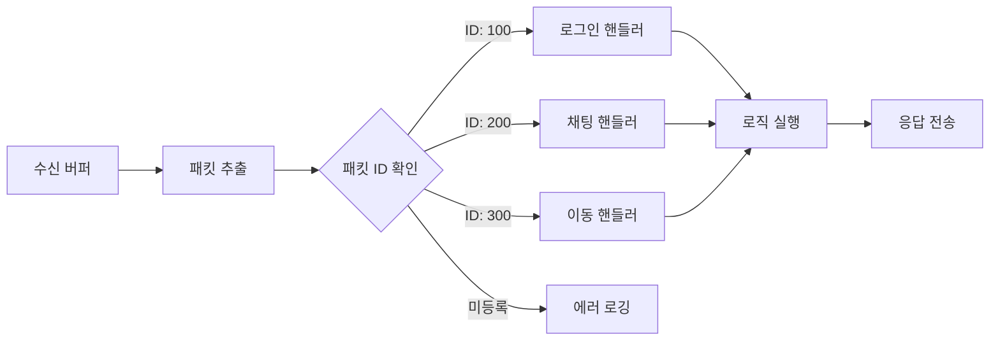

# 1주일만에 배우는 IOCP 게임 서버 프로그래밍   

저자: 최흥배, AI-Assisted   
    
권장 개발 환경
- **IDE**: Visual Studio 2022 (Community 이상)
- **컴파일러**: MSVC v143 (C++20 지원)
- **OS**: Windows 10 이상

-----   
  
# Chapter 6. 패킷 처리 시스템
지금까지 우리는 패킷의 구조를 설계하고 직렬화/역직렬화를 구현했다. 이제는 수신한 패킷을 분석하고 적절한 처리 함수로 라우팅하는 시스템을 구축할 차례다. 이 장에서는 확장 가능하고 유지보수가 쉬운 패킷 처리 아키텍처를 만들어본다.

패킷 처리 시스템은 게임 서버의 핵심이다. 클라이언트로부터 수신한 바이트 스트림을 의미 있는 패킷으로 조립하고, 각 패킷 타입에 맞는 핸들러를 실행하여 게임 로직을 수행한다. 이 과정에서 패킷의 무결성을 검증하고, 예외 상황을 처리하며, 새로운 패킷 타입을 쉽게 추가할 수 있는 구조를 만드는 것이 중요하다.
  

## 6.1 패킷 파싱과 조립
TCP는 스트림 기반 프로토콜이다. 따라서 송신 측에서 보낸 패킷이 수신 측에서 하나의 recv 호출로 완전히 수신된다는 보장이 없다. 하나의 패킷이 여러 번에 걸쳐 나누어 도착할 수도 있고(Fragmentation), 여러 패킷이 한 번에 도착할 수도 있다(Coalescing). 따라서 수신 버퍼에 쌓인 데이터에서 완전한 패킷을 추출하는 파싱 로직이 필요하다.

Chapter 5에서 정의한 패킷 구조를 다시 떠올려보자. 우리는 고정 헤더 방식을 사용했다.

```
[PacketSize(2)] [PacketID(2)] [Payload...]
```

패킷의 처음 2바이트는 전체 패킷 크기를, 다음 2바이트는 패킷 ID를 나타낸다. 이 정보를 이용하면 수신 버퍼에서 완전한 패킷을 추출할 수 있다.

패킷 파싱 알고리즘은 다음과 같다:

1. 수신 버퍼에 최소한 헤더 크기(4바이트)만큼의 데이터가 있는지 확인한다.
2. 헤더에서 PacketSize를 읽어온다.
3. 수신 버퍼에 PacketSize만큼의 데이터가 모두 있는지 확인한다.
4. 완전한 패킷이면 추출하고, 불완전하면 더 수신될 때까지 대기한다.
5. 남은 데이터로 1번부터 반복한다.

```
┌─────────────────────────────────────────┐
│        수신 버퍼 (Receive Buffer)        │
├────┬────┬──────────────┬────┬────┬──────┤
│Size│ ID │   Payload 1  │Size│ ID │Payloa│  ← 여러 패킷이 혼재
└────┴────┴──────────────┴────┴────┴──────┘
  │                        │
  └─ 완전한 패킷 1         └─ 불완전한 패킷 2
```

이를 구현한 핵심 코드는 다음과 같다:

```cpp
// 세션의 수신 버퍼에서 완전한 패킷들을 추출
std::vector<PacketPtr> Session::ExtractPackets()
{
    std::vector<PacketPtr> packets;
    
    while (recvBuffer_.GetDataSize() >= PACKET_HEADER_SIZE)
    {
        // 헤더에서 패킷 크기 읽기 (Peek, 실제로 제거하지 않음)
        uint16_t packetSize = 0;
        recvBuffer_.Peek(reinterpret_cast<char*>(&packetSize), sizeof(packetSize));
        
        // 패킷 크기 검증
        if (packetSize < PACKET_HEADER_SIZE || packetSize > MAX_PACKET_SIZE)
        {
            // 잘못된 패킷 크기 - 연결 종료
            return packets;
        }
        
        // 완전한 패킷이 도착했는지 확인
        if (recvBuffer_.GetDataSize() < packetSize)
        {
            // 아직 불완전 - 더 수신 대기
            break;
        }
        
        // 완전한 패킷 추출
        auto packet = std::make_shared<Packet>(packetSize);
        recvBuffer_.Read(packet->GetBuffer(), packetSize);
        packets.push_back(packet);
    }
    
    return packets;
}
```

이 코드는 수신 버퍼에서 완전한 패킷들을 모두 추출하여 벡터로 반환한다. Peek 함수를 사용하여 먼저 패킷 크기를 확인하고, 완전한 패킷이 준비되었을 때만 실제로 Read한다. 이렇게 하면 불완전한 패킷은 버퍼에 남아 있다가 다음 수신 때 나머지 데이터와 합쳐진다.

패킷 크기 검증은 매우 중요하다. 악의적인 클라이언트가 비정상적으로 큰 크기 값을 보내면 서버가 과도한 메모리를 할당하거나 크래시할 수 있다. 따라서 MIN_PACKET_SIZE와 MAX_PACKET_SIZE 범위를 벗어난 값은 즉시 거부해야 한다.
  

## 6.2 패킷 핸들러 설계 패턴
패킷을 성공적으로 추출했다면, 이제 해당 패킷을 처리할 핸들러를 실행해야 한다. 여기서 중요한 것은 확장 가능한 구조를 만드는 것이다. 새로운 패킷 타입이 추가될 때마다 거대한 switch-case 문을 수정하는 것은 유지보수가 어렵고 오류가 발생하기 쉽다.

Command 패턴을 활용하면 각 패킷 타입의 처리 로직을 독립적인 핸들러 클래스로 캡슐화할 수 있다. 이렇게 하면 핸들러의 추가, 수정, 제거가 용이하고, 코드의 응집도가 높아진다.

먼저 모든 패킷 핸들러의 기반이 되는 인터페이스를 정의한다:

```cpp
// 패킷 핸들러 인터페이스
class IPacketHandler
{
public:
    virtual ~IPacketHandler() = default;
    
    // 패킷 처리 (반환값: 성공 여부)
    virtual bool Handle(SessionPtr session, PacketReader& reader) = 0;
    
    // 핸들러가 처리할 패킷 ID
    virtual uint16_t GetPacketID() const = 0;
};
```

각 패킷 타입마다 이 인터페이스를 구현하는 구체적인 핸들러 클래스를 만든다. 예를 들어 로그인 패킷을 처리하는 핸들러는 다음과 같다:

```cpp
// 로그인 요청 핸들러
class LoginRequestHandler : public IPacketHandler
{
public:
    uint16_t GetPacketID() const override 
    { 
        return PKT_LOGIN_REQUEST; 
    }
    
    bool Handle(SessionPtr session, PacketReader& reader) override
    {
        // 패킷 데이터 읽기
        std::string userId = reader.ReadString();
        std::string password = reader.ReadString();
        
        if (reader.HasError())
        {
            return false;  // 파싱 실패
        }
        
        // 로그인 검증 로직
        bool loginSuccess = ValidateLogin(userId, password);
        
        // 응답 패킷 전송
        PacketWriter writer(PKT_LOGIN_RESPONSE);
        writer.Write<uint8_t>(loginSuccess ? 1 : 0);
        writer.WriteString(loginSuccess ? "환영합니다!" : "로그인 실패");
        
        session->Send(writer.GetPacket());
        
        return true;
    }
};
```

이런 방식으로 각 패킷마다 독립적인 핸들러 클래스를 작성하면, 각 핸들러는 자신이 담당하는 패킷의 처리 로직에만 집중할 수 있다. 또한 새로운 패킷 타입을 추가할 때 기존 코드를 수정할 필요가 없다.

핸들러를 더욱 세분화하여 요청 핸들러와 응답 핸들러를 구분할 수도 있다. 또는 특정 권한이 필요한 패킷을 위한 인증 검사 로직을 베이스 클래스에 추가할 수도 있다:

```cpp
// 인증이 필요한 패킷 핸들러
class AuthenticatedPacketHandler : public IPacketHandler
{
public:
    bool Handle(SessionPtr session, PacketReader& reader) final
    {
        // 로그인 상태 확인
        if (!session->IsAuthenticated())
        {
            // 에러 응답 전송
            SendErrorResponse(session, ERROR_NOT_AUTHENTICATED);
            return false;
        }
        
        // 실제 처리 로직은 자식 클래스에서
        return HandleAuthenticated(session, reader);
    }
    
protected:
    virtual bool HandleAuthenticated(SessionPtr session, PacketReader& reader) = 0;
};
```

이제 인증이 필요한 패킷 핸들러는 `AuthenticatedPacketHandler`를 상속받아 `HandleAuthenticated`만 구현하면 된다. 인증 검사 로직이 자동으로 실행된다.
  

## 6.3 패킷 디스패처 구현
패킷 디스패처는 패킷 ID와 해당 핸들러를 매핑하고, 수신한 패킷을 적절한 핸들러로 전달하는 역할을 한다. 이는 일종의 라우터 또는 멀티플렉서다.

디스패처는 패킷 ID를 키로, 핸들러를 값으로 하는 맵을 유지한다. IOCP 환경에서는 여러 워커 스레드가 동시에 패킷을 처리하므로, 핸들러 맵은 초기화 이후 수정되지 않는다면 별도의 동기화 없이 안전하게 읽을 수 있다.

```cpp
class PacketDispatcher
{
public:
    static PacketDispatcher& Instance()
    {
        static PacketDispatcher instance;
        return instance;
    }
    
    // 핸들러 등록 (서버 초기화 시 한 번만 호출)
    void RegisterHandler(std::unique_ptr<IPacketHandler> handler)
    {
        uint16_t packetID = handler->GetPacketID();
        
        if (handlers_.find(packetID) != handlers_.end())
        {
            // 중복 등록 경고
            LOG_WARNING("핸들러 중복 등록: PacketID={}", packetID);
        }
        
        handlers_[packetID] = std::move(handler);
        LOG_INFO("핸들러 등록: PacketID={}", packetID);
    }
    
    // 패킷 처리
    bool Dispatch(SessionPtr session, PacketPtr packet)
    {
        PacketReader reader(packet);
        
        // 헤더 읽기
        uint16_t packetSize = reader.Read<uint16_t>();
        uint16_t packetID = reader.Read<uint16_t>();
        
        if (reader.HasError())
        {
            LOG_ERROR("패킷 헤더 읽기 실패");
            return false;
        }
        
        // 핸들러 찾기
        auto it = handlers_.find(packetID);
        if (it == handlers_.end())
        {
            LOG_WARNING("등록되지 않은 패킷 ID: {}", packetID);
            return false;
        }
        
        // 핸들러 실행
        try
        {
            return it->second->Handle(session, reader);
        }
        catch (const std::exception& e)
        {
            LOG_ERROR("패킷 핸들러 예외: PacketID={}, Error={}", packetID, e.what());
            return false;
        }
    }
    
private:
    std::unordered_map<uint16_t, std::unique_ptr<IPacketHandler>> handlers_;
};
```

디스패처는 싱글톤 패턴으로 구현했다. 전역적으로 하나의 인스턴스만 존재하며, 모든 워커 스레드가 이를 공유한다. `RegisterHandler`는 서버 초기화 단계에서 메인 스레드가 호출하고, `Dispatch`는 워커 스레드들이 호출한다.

`Dispatch` 함수는 패킷에서 ID를 추출하고, 해당 ID에 등록된 핸들러를 찾아 실행한다. 핸들러가 예외를 던지더라도 서버가 크래시하지 않도록 try-catch로 감싸고, 로그를 남긴다.

디스패처 사용 예시는 다음과 같다:

```cpp
// IOCP 워커 스레드에서 패킷 수신 후
void Session::OnRecv(DWORD bytesTransferred)
{
    recvBuffer_.MoveWritePos(bytesTransferred);
    
    // 완전한 패킷들 추출
    auto packets = ExtractPackets();
    
    // 각 패킷을 디스패처로 전달
    for (auto& packet : packets)
    {
        PacketDispatcher::Instance().Dispatch(shared_from_this(), packet);
    }
    
    // 다음 수신 등록
    RegisterRecv();
}
```
  

## 6.4 핸들러 등록 및 라우팅
핸들러를 디스패처에 등록하는 방법은 여러 가지가 있다. 가장 간단한 방법은 서버 초기화 시 명시적으로 하나씩 등록하는 것이다:

```cpp
void InitializePacketHandlers()
{
    auto& dispatcher = PacketDispatcher::Instance();
    
    dispatcher.RegisterHandler(std::make_unique<LoginRequestHandler>());
    dispatcher.RegisterHandler(std::make_unique<ChatMessageHandler>());
    dispatcher.RegisterHandler(std::make_unique<MoveRequestHandler>());
    dispatcher.RegisterHandler(std::make_unique<AttackRequestHandler>());
    // ... 기타 핸들러들
}
```

하지만 이 방식은 새로운 핸들러를 추가할 때마다 이 함수를 수정해야 한다는 단점이 있다. 더 나은 방법은 자동 등록 메커니즘을 사용하는 것이다.

C++에서는 전역 객체의 생성자가 main 함수 실행 전에 호출된다는 특성을 이용할 수 있다. 각 핸들러 구현 파일에서 전역 변수를 선언하면 자동으로 등록된다:

```cpp
// LoginRequestHandler.cpp
namespace
{
    struct AutoRegister
    {
        AutoRegister()
        {
            PacketDispatcher::Instance().RegisterHandler(
                std::make_unique<LoginRequestHandler>()
            );
        }
    };
    
    AutoRegister g_autoRegister;  // 전역 객체 - 자동으로 생성자 실행
}
```

이 방식은 편리하지만, 전역 객체의 초기화 순서가 보장되지 않는다는 C++의 특성 때문에 주의가 필요하다. 디스패처가 먼저 초기화되지 않으면 문제가 발생할 수 있다.

또 다른 접근 방법은 템플릿을 활용한 매크로를 만드는 것이다:

```cpp
#define REGISTER_PACKET_HANDLER(HandlerClass) \
    namespace { \
        struct HandlerClass##_AutoRegister { \
            HandlerClass##_AutoRegister() { \
                PacketDispatcher::Instance().RegisterHandler( \
                    std::make_unique<HandlerClass>() \
                ); \
            } \
        }; \
        static HandlerClass##_AutoRegister g_##HandlerClass##_AutoRegister; \
    }

// 사용 예
REGISTER_PACKET_HANDLER(LoginRequestHandler)
REGISTER_PACKET_HANDLER(ChatMessageHandler)
```

이 매크로를 각 핸들러 구현 파일 끝에 추가하면 자동으로 등록된다.

라우팅 과정을 시각적으로 표현하면 다음과 같다:


  

## 6.5 패킷 검증과 에러 처리
패킷 처리 시스템에서 가장 중요한 것 중 하나는 철저한 검증과 에러 처리다. 클라이언트는 항상 신뢰할 수 없다고 가정해야 한다. 악의적인 클라이언트나 버그가 있는 클라이언트가 잘못된 패킷을 보낼 수 있고, 서버는 이에 대비해야 한다.

**패킷 크기 검증**  
패킷 크기가 정상 범위를 벗어나면 즉시 거부한다:

```cpp
bool ValidatePacketSize(uint16_t packetSize)
{
    if (packetSize < PACKET_HEADER_SIZE)
    {
        LOG_ERROR("패킷 크기가 헤더보다 작음: {}", packetSize);
        return false;
    }
    
    if (packetSize > MAX_PACKET_SIZE)
    {
        LOG_ERROR("패킷 크기가 최대 크기 초과: {}", packetSize);
        return false;
    }
    
    return true;
}
```

**패킷 구조 검증**  
각 패킷 타입마다 예상되는 페이로드 크기가 있다. 예를 들어 로그인 패킷은 최소한 사용자 ID 길이 정보를 담은 2바이트 이상이어야 한다:

```cpp
bool LoginRequestHandler::Handle(SessionPtr session, PacketReader& reader)
{
    // 최소 크기 확인
    if (reader.GetRemainingSize() < sizeof(uint16_t))
    {
        LOG_ERROR("로그인 패킷 크기 부족");
        return false;
    }
    
    std::string userId = reader.ReadString();
    if (userId.empty() || userId.length() > MAX_USER_ID_LENGTH)
    {
        LOG_ERROR("잘못된 사용자 ID 길이: {}", userId.length());
        return false;
    }
    
    // ... 계속 처리
}
```

**데이터 범위 검증**  
숫자 값이 유효한 범위 내에 있는지 확인한다:

```cpp
bool MoveRequestHandler::Handle(SessionPtr session, PacketReader& reader)
{
    int32_t x = reader.Read<int32_t>();
    int32_t y = reader.Read<int32_t>();
    
    // 맵 범위 검증
    if (x < 0 || x >= MAP_WIDTH || y < 0 || y >= MAP_HEIGHT)
    {
        LOG_WARNING("유효하지 않은 좌표: ({}, {})", x, y);
        return false;
    }
    
    // ... 이동 처리
}
```

**상태 검증**  
특정 패킷은 특정 상태에서만 처리되어야 한다. 예를 들어 게임 플레이 패킷은 로그인 후에만 유효하다:

```cpp
bool GamePlayHandler::Handle(SessionPtr session, PacketReader& reader)
{
    if (session->GetState() != SessionState::IN_GAME)
    {
        LOG_WARNING("잘못된 세션 상태에서 게임 패킷 수신: State={}", 
                    static_cast<int>(session->GetState()));
        return false;
    }
    
    // ... 게임 로직 처리
}
```

**에러 응답 전송**  
클라이언트에게 명확한 에러 메시지를 전송하여 문제를 디버깅할 수 있게 한다:

```cpp
void SendErrorResponse(SessionPtr session, ErrorCode errorCode, const std::string& message)
{
    PacketWriter writer(PKT_ERROR_RESPONSE);
    writer.Write<uint16_t>(static_cast<uint16_t>(errorCode));
    writer.WriteString(message);
    
    session->Send(writer.GetPacket());
    
    LOG_INFO("에러 응답 전송: SessionID={}, ErrorCode={}, Message={}", 
             session->GetID(), static_cast<int>(errorCode), message);
}
```

**플러드 방어**  
같은 패킷을 짧은 시간에 과도하게 보내는 것을 방지한다:

```cpp
class RateLimiter
{
public:
    bool CheckLimit(uint32_t sessionID, uint16_t packetID)
    {
        auto now = std::chrono::steady_clock::now();
        auto key = (static_cast<uint64_t>(sessionID) << 16) | packetID;
        
        auto& lastTime = lastPacketTime_[key];
        auto elapsed = std::chrono::duration_cast<std::chrono::milliseconds>(
            now - lastTime
        ).count();
        
        if (elapsed < MIN_PACKET_INTERVAL_MS)
        {
            LOG_WARNING("패킷 플러드 감지: Session={}, Packet={}", sessionID, packetID);
            return false;
        }
        
        lastTime = now;
        return true;
    }
    
private:
    concurrent_unordered_map<uint64_t, std::chrono::steady_clock::time_point> lastPacketTime_;
};
```

에러 처리 전략을 시각화하면 다음과 같다:

```
┌─────────────────┐
│  패킷 수신      │
└────────┬────────┘
         │
    ┌────▼────┐
    │크기 검증│
    └────┬────┘
         │ ✓
    ┌────▼────────┐
    │구조 검증    │
    └────┬────────┘
         │ ✓
    ┌────▼────────┐
    │상태 검증    │
    └────┬────────┘
         │ ✓
    ┌────▼────────┐
    │핸들러 실행  │
    └────┬────────┘
         │
    ┌────▼────────┐
    │응답 전송    │
    └─────────────┘

    (✗ 발생 시 → 에러 응답 & 로깅)
```
  

## 6.6 전체 서버 코드
이제 이 챕터에서 다룬 모든 내용을 통합한 전체 서버 코드를 살펴본다. 패킷 처리 시스템의 모든 구성 요소가 어떻게 함께 작동하는지 확인할 수 있다.

**PacketHandler.h**

```cpp
#pragma once
#include <cstdint>
#include <memory>
#include <string>
#include "Session.h"
#include "PacketReader.h"
#include "PacketWriter.h"

// 패킷 ID 정의
enum PacketID : uint16_t
{
    PKT_NONE = 0,
    
    // 인증 관련
    PKT_LOGIN_REQUEST = 100,
    PKT_LOGIN_RESPONSE = 101,
    PKT_LOGOUT_REQUEST = 102,
    
    // 채팅 관련
    PKT_CHAT_MESSAGE = 200,
    PKT_CHAT_BROADCAST = 201,
    
    // 게임 관련
    PKT_MOVE_REQUEST = 300,
    PKT_MOVE_BROADCAST = 301,
    PKT_ATTACK_REQUEST = 302,
    PKT_ATTACK_BROADCAST = 303,
    
    // 에러
    PKT_ERROR_RESPONSE = 9999,
};

// 에러 코드
enum class ErrorCode : uint16_t
{
    NONE = 0,
    INVALID_PACKET = 1,
    NOT_AUTHENTICATED = 2,
    INVALID_STATE = 3,
    INVALID_DATA = 4,
    RATE_LIMIT_EXCEEDED = 5,
};

// 패킷 핸들러 인터페이스
class IPacketHandler
{
public:
    virtual ~IPacketHandler() = default;
    virtual bool Handle(SessionPtr session, PacketReader& reader) = 0;
    virtual uint16_t GetPacketID() const = 0;
};

// 인증이 필요한 패킷 핸들러 베이스
class AuthenticatedPacketHandler : public IPacketHandler
{
public:
    bool Handle(SessionPtr session, PacketReader& reader) final
    {
        if (!session->IsAuthenticated())
        {
            SendErrorResponse(session, ErrorCode::NOT_AUTHENTICATED, 
                            "인증이 필요합니다");
            return false;
        }
        return HandleAuthenticated(session, reader);
    }
    
protected:
    virtual bool HandleAuthenticated(SessionPtr session, PacketReader& reader) = 0;
    void SendErrorResponse(SessionPtr session, ErrorCode errorCode, 
                          const std::string& message);
};

// 구체적인 핸들러들
class LoginRequestHandler : public IPacketHandler
{
public:
    uint16_t GetPacketID() const override { return PKT_LOGIN_REQUEST; }
    bool Handle(SessionPtr session, PacketReader& reader) override;
};

class LogoutRequestHandler : public AuthenticatedPacketHandler
{
public:
    uint16_t GetPacketID() const override { return PKT_LOGOUT_REQUEST; }
    
protected:
    bool HandleAuthenticated(SessionPtr session, PacketReader& reader) override;
};

class ChatMessageHandler : public AuthenticatedPacketHandler
{
public:
    uint16_t GetPacketID() const override { return PKT_CHAT_MESSAGE; }
    
protected:
    bool HandleAuthenticated(SessionPtr session, PacketReader& reader) override;
};

class MoveRequestHandler : public AuthenticatedPacketHandler
{
public:
    uint16_t GetPacketID() const override { return PKT_MOVE_REQUEST; }
    
protected:
    bool HandleAuthenticated(SessionPtr session, PacketReader& reader) override;
};

class AttackRequestHandler : public AuthenticatedPacketHandler
{
public:
    uint16_t GetPacketID() const override { return PKT_ATTACK_REQUEST; }
    
protected:
    bool HandleAuthenticated(SessionPtr session, PacketReader& reader) override;
};
```

**PacketDispatcher.h**

```cpp
#pragma once
#include <unordered_map>
#include <memory>
#include <mutex>
#include "PacketHandler.h"
#include "Packet.h"

class PacketDispatcher
{
public:
    static PacketDispatcher& Instance()
    {
        static PacketDispatcher instance;
        return instance;
    }
    
    // 핸들러 등록
    void RegisterHandler(std::unique_ptr<IPacketHandler> handler);
    
    // 패킷 처리
    bool Dispatch(SessionPtr session, PacketPtr packet);
    
    // 등록된 핸들러 수
    size_t GetHandlerCount() const { return handlers_.size(); }
    
private:
    PacketDispatcher() = default;
    ~PacketDispatcher() = default;
    PacketDispatcher(const PacketDispatcher&) = delete;
    PacketDispatcher& operator=(const PacketDispatcher&) = delete;
    
    std::unordered_map<uint16_t, std::unique_ptr<IPacketHandler>> handlers_;
};

// 핸들러 자동 등록 매크로
#define REGISTER_PACKET_HANDLER(HandlerClass) \
    namespace { \
        struct HandlerClass##_AutoRegister { \
            HandlerClass##_AutoRegister() { \
                PacketDispatcher::Instance().RegisterHandler( \
                    std::make_unique<HandlerClass>() \
                ); \
            } \
        }; \
        static HandlerClass##_AutoRegister g_##HandlerClass##_AutoRegister; \
    }
```

**PacketDispatcher.cpp**

```cpp
#include "PacketDispatcher.h"
#include "Logger.h"
#include <format>

void PacketDispatcher::RegisterHandler(std::unique_ptr<IPacketHandler> handler)
{
    uint16_t packetID = handler->GetPacketID();
    
    if (handlers_.find(packetID) != handlers_.end())
    {
        LOG_WARNING("핸들러 중복 등록: PacketID={}", packetID);
        return;
    }
    
    handlers_[packetID] = std::move(handler);
    LOG_INFO("핸들러 등록: PacketID={}", packetID);
}

bool PacketDispatcher::Dispatch(SessionPtr session, PacketPtr packet)
{
    if (!session || !packet)
    {
        LOG_ERROR("유효하지 않은 세션 또는 패킷");
        return false;
    }
    
    PacketReader reader(packet);
    
    // 헤더 읽기
    uint16_t packetSize = reader.Read<uint16_t>();
    uint16_t packetID = reader.Read<uint16_t>();
    
    if (reader.HasError())
    {
        LOG_ERROR("패킷 헤더 읽기 실패: SessionID={}", session->GetID());
        return false;
    }
    
    // 핸들러 찾기
    auto it = handlers_.find(packetID);
    if (it == handlers_.end())
    {
        LOG_WARNING("등록되지 않은 패킷 ID: {} (SessionID={})", 
                   packetID, session->GetID());
        return false;
    }
    
    // 핸들러 실행
    try
    {
        bool result = it->second->Handle(session, reader);
        
        if (!result)
        {
            LOG_WARNING("패킷 처리 실패: PacketID={}, SessionID={}", 
                       packetID, session->GetID());
        }
        
        return result;
    }
    catch (const std::exception& e)
    {
        LOG_ERROR("패킷 핸들러 예외: PacketID={}, SessionID={}, Error={}", 
                 packetID, session->GetID(), e.what());
        return false;
    }
}
```

**PacketHandlers.cpp**

```cpp
#include "PacketHandler.h"
#include "PacketDispatcher.h"
#include "SessionManager.h"
#include "Logger.h"

constexpr size_t MAX_USER_ID_LENGTH = 20;
constexpr size_t MAX_PASSWORD_LENGTH = 20;
constexpr size_t MAX_CHAT_MESSAGE_LENGTH = 256;
constexpr int32_t MAP_WIDTH = 1000;
constexpr int32_t MAP_HEIGHT = 1000;

// 에러 응답 전송
void AuthenticatedPacketHandler::SendErrorResponse(SessionPtr session, 
                                                   ErrorCode errorCode, 
                                                   const std::string& message)
{
    PacketWriter writer(PKT_ERROR_RESPONSE);
    writer.Write<uint16_t>(static_cast<uint16_t>(errorCode));
    writer.WriteString(message);
    session->Send(writer.GetPacket());
    
    LOG_INFO("에러 응답 전송: SessionID={}, ErrorCode={}, Message={}", 
             session->GetID(), static_cast<int>(errorCode), message);
}

// 로그인 요청 핸들러
bool LoginRequestHandler::Handle(SessionPtr session, PacketReader& reader)
{
    // 이미 로그인된 상태인지 확인
    if (session->IsAuthenticated())
    {
        LOG_WARNING("이미 로그인된 세션: SessionID={}", session->GetID());
        return false;
    }
    
    // 데이터 읽기
    std::string userId = reader.ReadString();
    std::string password = reader.ReadString();
    
    if (reader.HasError())
    {
        LOG_ERROR("로그인 패킷 파싱 실패: SessionID={}", session->GetID());
        return false;
    }
    
    // 데이터 검증
    if (userId.empty() || userId.length() > MAX_USER_ID_LENGTH ||
        password.empty() || password.length() > MAX_PASSWORD_LENGTH)
    {
        LOG_WARNING("잘못된 로그인 데이터: SessionID={}, UserID={}", 
                   session->GetID(), userId);
        
        PacketWriter writer(PKT_LOGIN_RESPONSE);
        writer.Write<uint8_t>(0);  // 실패
        writer.WriteString("잘못된 사용자 정보");
        session->Send(writer.GetPacket());
        return true;
    }
    
    // 간단한 로그인 검증 (실제로는 DB 조회 등을 수행)
    bool loginSuccess = (userId == "test" && password == "1234");
    
    if (loginSuccess)
    {
        session->SetAuthenticated(true);
        session->SetUserID(userId);
        LOG_INFO("로그인 성공: SessionID={}, UserID={}", session->GetID(), userId);
    }
    else
    {
        LOG_INFO("로그인 실패: SessionID={}, UserID={}", session->GetID(), userId);
    }
    
    // 응답 전송
    PacketWriter writer(PKT_LOGIN_RESPONSE);
    writer.Write<uint8_t>(loginSuccess ? 1 : 0);
    writer.WriteString(loginSuccess ? "환영합니다!" : "로그인 실패");
    session->Send(writer.GetPacket());
    
    return true;
}

// 로그아웃 요청 핸들러
bool LogoutRequestHandler::HandleAuthenticated(SessionPtr session, PacketReader& reader)
{
    LOG_INFO("로그아웃 요청: SessionID={}, UserID={}", 
             session->GetID(), session->GetUserID());
    
    session->SetAuthenticated(false);
    session->Disconnect();
    
    return true;
}

// 채팅 메시지 핸들러
bool ChatMessageHandler::HandleAuthenticated(SessionPtr session, PacketReader& reader)
{
    std::string message = reader.ReadString();
    
    if (reader.HasError())
    {
        LOG_ERROR("채팅 패킷 파싱 실패: SessionID={}", session->GetID());
        return false;
    }
    
    if (message.empty() || message.length() > MAX_CHAT_MESSAGE_LENGTH)
    {
        LOG_WARNING("잘못된 채팅 메시지 길이: SessionID={}, Length={}", 
                   session->GetID(), message.length());
        return false;
    }
    
    LOG_INFO("채팅 메시지: UserID={}, Message={}", session->GetUserID(), message);
    
    // 모든 접속자에게 브로드캐스트
    PacketWriter writer(PKT_CHAT_BROADCAST);
    writer.WriteString(session->GetUserID());
    writer.WriteString(message);
    
    auto packet = writer.GetPacket();
    SessionManager::Instance().BroadcastPacket(packet);
    
    return true;
}

// 이동 요청 핸들러
bool MoveRequestHandler::HandleAuthenticated(SessionPtr session, PacketReader& reader)
{
    int32_t x = reader.Read<int32_t>();
    int32_t y = reader.Read<int32_t>();
    
    if (reader.HasError())
    {
        LOG_ERROR("이동 패킷 파싱 실패: SessionID={}", session->GetID());
        return false;
    }
    
    // 좌표 검증
    if (x < 0 || x >= MAP_WIDTH || y < 0 || y >= MAP_HEIGHT)
    {
        LOG_WARNING("유효하지 않은 좌표: SessionID={}, ({}, {})", 
                   session->GetID(), x, y);
        
        SendErrorResponse(session, ErrorCode::INVALID_DATA, "유효하지 않은 좌표");
        return false;
    }
    
    // 위치 업데이트
    session->SetPosition(x, y);
    LOG_INFO("플레이어 이동: UserID={}, Pos=({}, {})", 
             session->GetUserID(), x, y);
    
    // 주변 플레이어들에게 브로드캐스트
    PacketWriter writer(PKT_MOVE_BROADCAST);
    writer.WriteString(session->GetUserID());
    writer.Write<int32_t>(x);
    writer.Write<int32_t>(y);
    
    auto packet = writer.GetPacket();
    SessionManager::Instance().BroadcastPacket(packet);
    
    return true;
}

// 공격 요청 핸들러
bool AttackRequestHandler::HandleAuthenticated(SessionPtr session, PacketReader& reader)
{
    std::string targetUserID = reader.ReadString();
    
    if (reader.HasError())
    {
        LOG_ERROR("공격 패킷 파싱 실패: SessionID={}", session->GetID());
        return false;
    }
    
    if (targetUserID.empty() || targetUserID.length() > MAX_USER_ID_LENGTH)
    {
        LOG_WARNING("잘못된 공격 대상: SessionID={}, Target={}", 
                   session->GetID(), targetUserID);
        return false;
    }
    
    LOG_INFO("플레이어 공격: UserID={}, Target={}", 
             session->GetUserID(), targetUserID);
    
    // 공격 브로드캐스트
    PacketWriter writer(PKT_ATTACK_BROADCAST);
    writer.WriteString(session->GetUserID());
    writer.WriteString(targetUserID);
    
    auto packet = writer.GetPacket();
    SessionManager::Instance().BroadcastPacket(packet);
    
    return true;
}

// 핸들러 자동 등록
REGISTER_PACKET_HANDLER(LoginRequestHandler)
REGISTER_PACKET_HANDLER(LogoutRequestHandler)
REGISTER_PACKET_HANDLER(ChatMessageHandler)
REGISTER_PACKET_HANDLER(MoveRequestHandler)
REGISTER_PACKET_HANDLER(AttackRequestHandler)
```

**Session.h (패킷 처리 부분 추가)**

```cpp
#pragma once
#include <memory>
#include <string>
#include <atomic>
#include "RingBuffer.h"
#include "Packet.h"

class Session : public std::enable_shared_from_this<Session>
{
public:
    explicit Session(SOCKET socket);
    ~Session();
    
    // ... 기존 멤버들 ...
    
    // 인증 관련
    bool IsAuthenticated() const { return isAuthenticated_.load(); }
    void SetAuthenticated(bool value) { isAuthenticated_.store(value); }
    
    const std::string& GetUserID() const { return userID_; }
    void SetUserID(const std::string& userID) { userID_ = userID; }
    
    // 위치 관련
    void SetPosition(int32_t x, int32_t y) 
    { 
        posX_.store(x); 
        posY_.store(y); 
    }
    
    void GetPosition(int32_t& x, int32_t& y) const
    {
        x = posX_.load();
        y = posY_.load();
    }
    
    // 패킷 추출
    std::vector<PacketPtr> ExtractPackets();
    
private:
    void OnRecv(DWORD bytesTransferred);
    void OnSend(DWORD bytesTransferred);
    
    // ... 기존 멤버들 ...
    
    std::atomic<bool> isAuthenticated_{false};
    std::string userID_;
    std::atomic<int32_t> posX_{0};
    std::atomic<int32_t> posY_{0};
};
```

**Session.cpp (패킷 처리 부분)**

```cpp
#include "Session.h"
#include "PacketDispatcher.h"
#include "Logger.h"

constexpr size_t PACKET_HEADER_SIZE = 4;
constexpr size_t MAX_PACKET_SIZE = 8192;

std::vector<PacketPtr> Session::ExtractPackets()
{
    std::vector<PacketPtr> packets;
    
    while (recvBuffer_.GetDataSize() >= PACKET_HEADER_SIZE)
    {
        // 패킷 크기 읽기 (Peek)
        uint16_t packetSize = 0;
        recvBuffer_.Peek(reinterpret_cast<char*>(&packetSize), sizeof(packetSize));
        
        // 패킷 크기 검증
        if (packetSize < PACKET_HEADER_SIZE)
        {
            LOG_ERROR("패킷 크기가 헤더보다 작음: Size={}, SessionID={}", 
                     packetSize, sessionID_);
            Disconnect();
            break;
        }
        
        if (packetSize > MAX_PACKET_SIZE)
        {
            LOG_ERROR("패킷 크기가 최대 크기 초과: Size={}, SessionID={}", 
                     packetSize, sessionID_);
            Disconnect();
            break;
        }
        
        // 완전한 패킷이 도착했는지 확인
        if (recvBuffer_.GetDataSize() < packetSize)
        {
            // 아직 불완전 - 더 수신 대기
            break;
        }
        
        // 완전한 패킷 추출
        auto packet = std::make_shared<Packet>(packetSize);
        size_t readSize = recvBuffer_.Read(packet->GetBuffer(), packetSize);
        
        if (readSize != packetSize)
        {
            LOG_ERROR("패킷 읽기 실패: Expected={}, Actual={}, SessionID={}", 
                     packetSize, readSize, sessionID_);
            Disconnect();
            break;
        }
        
        packets.push_back(packet);
    }
    
    return packets;
}

void Session::OnRecv(DWORD bytesTransferred)
{
    if (bytesTransferred == 0)
    {
        Disconnect();
        return;
    }
    
    // 수신 버퍼에 데이터 추가
    recvBuffer_.MoveWritePos(bytesTransferred);
    
    // 완전한 패킷들 추출
    auto packets = ExtractPackets();
    
    // 각 패킷을 디스패처로 전달
    for (auto& packet : packets)
    {
        PacketDispatcher::Instance().Dispatch(shared_from_this(), packet);
    }
    
    // 다음 수신 등록
    RegisterRecv();
}
```

**SessionManager.h (브로드캐스트 추가)**

```cpp
#pragma once
#include <concurrent_unordered_map.h>
#include "Session.h"
#include "Packet.h"

class SessionManager
{
public:
    static SessionManager& Instance()
    {
        static SessionManager instance;
        return instance;
    }
    
    void AddSession(SessionPtr session);
    void RemoveSession(uint32_t sessionID);
    SessionPtr GetSession(uint32_t sessionID);
    size_t GetSessionCount() const;
    
    // 모든 세션에 패킷 브로드캐스트
    void BroadcastPacket(PacketPtr packet);
    
    // 특정 세션을 제외하고 브로드캐스트
    void BroadcastPacket(PacketPtr packet, uint32_t excludeSessionID);
    
private:
    SessionManager() = default;
    ~SessionManager() = default;
    
    concurrency::concurrent_unordered_map<uint32_t, SessionPtr> sessions_;
};
```

**SessionManager.cpp (브로드캐스트 구현)**

```cpp
#include "SessionManager.h"
#include "Logger.h"

void SessionManager::BroadcastPacket(PacketPtr packet)
{
    for (auto& pair : sessions_)
    {
        pair.second->Send(packet);
    }
    
    LOG_DEBUG("패킷 브로드캐스트: SessionCount={}", sessions_.size());
}

void SessionManager::BroadcastPacket(PacketPtr packet, uint32_t excludeSessionID)
{
    size_t count = 0;
    
    for (auto& pair : sessions_)
    {
        if (pair.first != excludeSessionID)
        {
            pair.second->Send(packet);
            ++count;
        }
    }
    
    LOG_DEBUG("패킷 브로드캐스트 (제외 포함): Count={}, Exclude={}", 
             count, excludeSessionID);
}
```

**Main.cpp (초기화 부분)**

```cpp
#include "IOCPServer.h"
#include "PacketDispatcher.h"
#include "Logger.h"

int main()
{
    // 로거 초기화
    Logger::Instance().Initialize("GameServer.log");
    
    LOG_INFO("=== 게임 서버 시작 ===");
    
    // 패킷 핸들러 등록 확인
    size_t handlerCount = PacketDispatcher::Instance().GetHandlerCount();
    LOG_INFO("등록된 패킷 핸들러 수: {}", handlerCount);
    
    // IOCP 서버 생성 및 시작
    IOCPServer server;
    
    if (!server.Initialize(7777, 4))
    {
        LOG_ERROR("서버 초기화 실패");
        return 1;
    }
    
    LOG_INFO("서버 초기화 완료 - Port: 7777, WorkerThreads: 4");
    
    if (!server.Start())
    {
        LOG_ERROR("서버 시작 실패");
        return 1;
    }
    
    LOG_INFO("서버 시작 완료 - 클라이언트 연결 대기 중...");
    
    // 서버 실행 (종료 명령까지 대기)
    std::string command;
    while (true)
    {
        std::getline(std::cin, command);
        
        if (command == "quit" || command == "exit")
        {
            LOG_INFO("서버 종료 명령 수신");
            break;
        }
        else if (command == "status")
        {
            size_t sessionCount = SessionManager::Instance().GetSessionCount();
            LOG_INFO("현재 접속자 수: {}", sessionCount);
        }
    }
    
    // 서버 종료
    server.Stop();
    LOG_INFO("=== 게임 서버 종료 ===");
    
    return 0;
}
```

이제 패킷 처리 시스템이 완성되었다. 클라이언트로부터 수신한 바이트 스트림은 완전한 패킷으로 조립되고, 패킷 ID에 따라 적절한 핸들러로 라우팅되어 처리된다. 각 핸들러는 독립적으로 구현되어 있어 유지보수가 쉽고, 새로운 패킷 타입을 추가할 때도 기존 코드를 수정할 필요가 없다.

다음 챕터에서는 IOCP의 멀티스레드 환경에서 발생할 수 있는 동기화 문제를 다루고, 안전하게 세션 데이터를 관리하는 기법을 학습한다.  